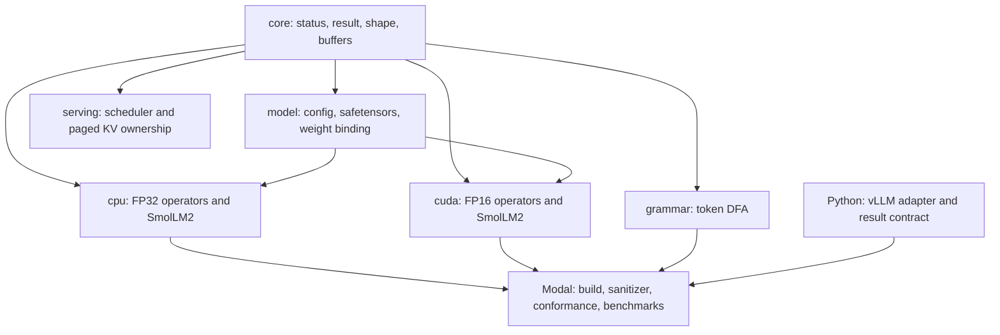

# Architecture

`market_sim` isolates four concerns: artifact validation, model execution,
constrained decoding, and serving-state management. The CPU and CUDA backends
share model contracts but do not share operator implementations. That split
makes the CPU path useful as an oracle instead of a second wrapper around the
same kernels.

## Dependency boundaries

| Area | Responsibility | Deliberate exclusion |
|---|---|---|
| `core` | Checked arithmetic, tensor views, mapped files, owned host buffers, errors | General tensor framework |
| `model` | JSON/config validation, safetensors parsing, exact weight binding | Dynamic architecture discovery |
| `cpu` | FP32 transformer oracle and full SmolLM2 decode | Training and autograd |
| `cuda` | FP16 full-model execution and focused kernels | Multi-GPU execution |
| `grammar` | Prefix-free token sequences and legal-next-token lookup | Application policy |
| `serving` | Sequence state and transactional KV-page ownership | Network transport and device KV storage |
| `tools/inference` | Backend-neutral evidence schema and vLLM adapter | Online serving API |
| `tools/modal` | Reproducible Linux/CUDA gates with cost limits | Unbounded cloud jobs |

## Model load and execution

The runtime never infers a model contract from tensor names alone.

1. `model-lock.json` selects an immutable repository revision and exact artifact
   hashes.
2. The config parser rejects duplicate keys, unknown architecture values,
   invalid dimensions, and unsupported numeric modes.
3. The safetensors loader validates header bounds, non-overlapping byte ranges,
   dtypes, shapes, and file size before exposing tensor views.
4. Weight binding matches every expected SmolLM2 tensor by name, shape, and
   dtype.
5. CPU execution converts the bound weights into its FP32 oracle form. CUDA
   execution materializes FP16 device buffers and owns its stream and cuBLAS
   handle explicitly.

The full-model paths implement embedding lookup, 30 decoder layers, final
RMSNorm, tied output projection, and greedy selection. Each decoder layer runs
attention normalization, Q/K/V projections, RoPE, causal grouped-query
attention, output projection, residual update, post-attention normalization,
SwiGLU MLP projections, and the final residual update.

### Numeric contract

- The readable CPU path uses FP32.
- CUDA weights and activations use FP16.
- cuBLAS projections and comparison-sensitive reductions accumulate in FP32.
- Greedy ties resolve to the lowest token ID.
- NaN candidates do not win. An all-NaN legal set falls back to its lowest
  token ID.

The CPU path is a behavioral oracle, not a requirement for bitwise equality
with FP16 execution. Accepted full-model conformance compares the final greedy
token sequence across the CPU fixture, native CUDA, and vLLM.

## Constrained output projection

A generic token DFA stores prefix-free token sequences and opaque choice IDs.
For a given state, it returns the legal next token IDs. Application-specific
actions are compiled into this representation outside the core grammar type.

The ordinary CUDA path computes all 49,152 tied-embedding scores and then runs
greedy selection. The restricted path receives at most 128 legal token IDs,
scores only those embedding rows, and reduces directly to one token. It avoids
allocating or writing a full-vocabulary logit tensor for that step.

Before launching the restricted kernel, the host API validates the candidate
set and capacity. Device code still handles invalid rows and empty counts with
an explicit sentinel, so malformed device input cannot silently select an
unrelated vocabulary row.

## State and ownership

The runtime uses explicit ownership rather than ambient CUDA state:

- move-only host and device buffers own allocations;
- mapped files own their mapping lifetime;
- `CudaStream` and `CublasHandle` are move-only RAII wrappers;
- model objects own weights, layer-local KV storage, execution scratch, and
  context length;
- reset and repeated-decode tests cover lifecycle transitions.

The scheduler tracks queued, decoding, paused, finished, and cancelled
sequences. A scheduled item is marked in flight until a matching completion
commits. Invalid completions leave accounting unchanged.

`PagedKvCache` manages logical page ownership in two phases:

1. `reserve` selects free pages without changing committed sequence state.
2. `commit` publishes the new page table, while `rollback` returns every page.

Published prefixes are immutable and reference counted. Metrics distinguish
payload tokens, reserved capacity, fragmentation, physical pages, and logical
attachments.

This allocator is currently a control-plane model. Native CUDA inference owns
contiguous layer-local KV buffers, so connecting scheduler page tables to
physical device pages remains future work.

## Evidence path

Default tests are offline and CPU-only. They cover malformed artifacts,
operator fixtures, scheduler transitions, KV rollback, token-DFA properties,
and deterministic workload behavior. Sanitizer presets add ASan and UBSan.

GPU gates upload a clean Git archive rather than the working directory. Every
accepted artifact records the commit, source-archive SHA-256, locked model,
compiler/runtime versions, GPU identity, test counts, and measurements. The
native CUDA gate also runs Compute Sanitizer canaries before accepting a clean
production result.

The vLLM lane is intentionally separate. It uses token-ID input, disables
tokenization and detokenization, pins vLLM and the checkpoint, and writes the
same result contract as the native path.

## Extension points

Adding a model architecture requires an explicit config validator, weight map,
operator contract, and conformance fixture. A backend should consume the same
token-ID request and evidence schema, but it may use different internal
numeric modes.

Turning the control-plane code into a server would require work that is absent
today: tokenizer ownership, request transport, scheduler-to-GPU batch wiring,
physical paged KV kernels, cancellation across device work, observability,
backpressure, and worker recovery. Those are product-level additions, not
features hidden behind the current interfaces.
