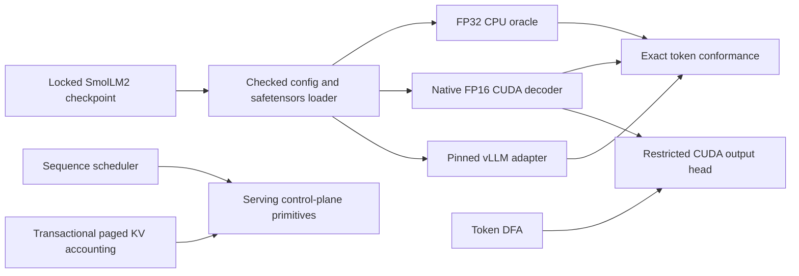

# market_sim

[](https://github.com/pathupally/Market_Sim/actions/workflows/ci.yml)

A C++20/CUDA runtime for small-model inference and constrained decoding.

`market_sim` runs the full 30-layer SmolLM2-135M decoder through a readable
FP32 CPU implementation and a native FP16 CUDA implementation. A pinned vLLM
adapter provides an external reference point. All three paths accept token IDs
and emit the same strict result schema.

The main optimization is a restricted CUDA output head. When a token DFA
allows only a small set of next tokens, the kernel scores those tied-embedding
rows directly instead of materializing 49,152 logits.

## Measured results

One source-bound run on an NVIDIA L4 produced the following results:

| Measurement | Result |
|---|---:|
| Native CUDA and vLLM greedy output | `[198, 198, 504]` |
| Restricted-head token parity | 12 / 12 benchmark cells |
| Restricted head vs. full output projection | 1.272x to 20.717x |
| vLLM CUDA Graph vs. eager, one request | 3.378x |
| vLLM CUDA Graph vs. eager, batch of 16 | 2.089x |
| vLLM warm shared prefix vs. cold prefix | 2.170x |

The run is bound to commit `236c0346` and source archive SHA-256
`1f6ec1e5cd42ab84a8f907ff2eed77ed60dc5f81feffd56a5b3eb0b3295f8da2`.
These figures describe one locked model and one L4; they are not generalized
serving claims. [BENCHMARKS.md](BENCHMARKS.md) contains the full matrix,
methodology, and limits.

## System design



The CUDA path uses cuBLAS for dense projections and custom kernels for
RMSNorm, RoPE, causal grouped-query attention, SwiGLU, embedding lookup,
residual updates, KV writes, and greedy selection. FP16 storage and inputs use
FP32 accumulation where numerical stability or deterministic comparisons
matter.

The serving layer contains a deterministic round-robin scheduler and a paged
KV allocator with reservation, rollback, and immutable shared prefixes. Those
components are tested control-plane primitives. They do not yet drive the
native model's physical CUDA KV buffers.

See [ARCHITECTURE.md](ARCHITECTURE.md) for ownership rules, dependency
boundaries, and extension points.

## Build and test

The default build is CPU-only. It does not download model weights or initialize
CUDA.

```sh
cmake -S . -B build/local -DCMAKE_BUILD_TYPE=Debug
cmake --build build/local --parallel
ctest --test-dir build/local --output-on-failure
```

The repository also provides macOS presets used during local development:

```sh
cmake --preset mac-debug
cmake --build --preset mac-debug
ctest --preset mac-debug

cmake --preset mac-sanitize
cmake --build --preset mac-sanitize
ctest --preset mac-sanitize
```

Run the Python contract and tooling tests after installing the small Modal test
dependency set:

```sh
python3 -m venv .venv
.venv/bin/python -m pip install -r tools/modal/requirements.txt
.venv/bin/python -m unittest discover -s tools/inference -t . -p 'test_*.py'
.venv/bin/python -m unittest discover -s tools/model -t . -p 'test_*.py'
.venv/bin/python -m unittest discover -s tools/modal -t . -p 'test_*.py'
```

GitHub Actions runs warnings-as-errors and ASan/UBSan C++ builds on Linux, then
runs all three Python suites on every push and pull request.

## Model and GPU policy

Weights are never committed. The runtime locks
[`HuggingFaceTB/SmolLM2-135M`](https://huggingface.co/HuggingFaceTB/SmolLM2-135M)
to revision `93efa2f097d58c2a74874c7e644dbc9b0cee75a2`. The single BF16
safetensors file is 269,060,552 bytes. Opt-in tooling checks the revision, file
size, SHA-256, tensor names, shapes, and dtypes before execution.

Native CUDA targets compile for compute capability 8.9. The accepted native
gate pins CUDA 12.6.3; the vLLM image pins CUDA 12.9 and vLLM 0.25.1. Each
remote gate names its GPU, timeout, and cost ceiling before dispatch. Reproduction
commands and budget checks are documented in
[`tools/modal/README.md`](tools/modal/README.md). Model download rules are in
[`models/README.md`](models/README.md).

## Current boundary

This is an inference-systems prototype, not a production model server.

- Inputs are pretokenized. There is no native tokenizer or text-generation API.
- Full-model execution targets the locked SmolLM2-135M architecture.
- Decoding is greedy; the accepted conformance case emits three tokens.
- There is no HTTP server, multi-node worker manager, or fault recovery layer.
- Scheduler and paged-KV state are not connected to device-resident KV pages.
- The radar replay and prediction-market code are deterministic test clients.
  They do not call the model or report wall-clock inference latency.

The narrow boundary keeps the implemented systems work reviewable without
implying a serving product that does not exist.

## Repository guide

- `include/marketforge`, `src/cpu`, `src/cuda`: runtime interfaces and model
  execution.
- `src/grammar`: generic token DFA and restricted-decoding fixtures.
- `src/serving`: scheduling and paged KV ownership.
- `tools/inference`: result contract and vLLM adapter.
- `tools/model`: locked fetch, conformance, and DFA-generation tools.
- `tools/modal`: bounded Linux and NVIDIA L4 validation jobs.
- `tests`: CPU, CUDA, property, failure-path, and fixture tests.
- `docs`: accepted scope decisions, benchmark contracts, and raw result JSON.
- `demo`, `src/workloads`: optional deterministic scheduler fixture.

`marketforge_*` remains the implementation namespace and target prefix from the
first prototype. The repository and CMake project are named `market_sim`.

## License

Apache-2.0. See [LICENSE](LICENSE).
