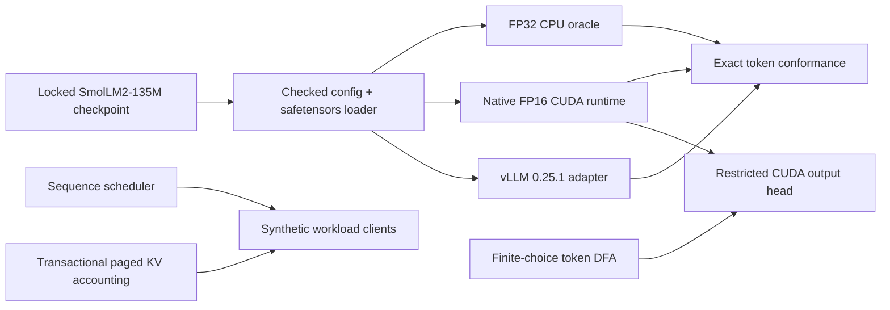

# market_sim

[](https://github.com/pathupally/Market_Sim/actions/workflows/ci.yml)

A C++20/CUDA inference runtime for constrained decoding with small language
models. The current runtime executes the full 30-layer SmolLM2-135M decoder,
checks its output against a readable CPU implementation and a pinned vLLM
backend, and records source-bound NVIDIA L4 evidence.

The narrow scope is intentional. `market_sim` accepts token IDs, runs greedy
inference, and focuses on the systems work around model loading, transformer
kernels, output projection, request scheduling, and KV-cache ownership.

## Runtime at a glance



The native CUDA path combines cuBLAS projections with custom kernels for
RMSNorm, RoPE, causal grouped-query attention, SwiGLU, embeddings, residual
updates, KV writes, and greedy selection. A separate restricted output-head
kernel scores only the tied-embedding rows that are legal in the current token
DFA state. Dot products accumulate in FP32 and ties resolve to the lowest token
ID.

The serving layer has a deterministic round-robin scheduler plus a paged KV
allocator with transactional reservation, rollback, and immutable shared
prefixes. These components have failure-path and property tests; they are not
presented as a deployed inference service.

## Measured on NVIDIA L4

The committed result below is one run bound to commit `236c0346` and source
archive SHA-256 `1f6ec1e5cd42ab84a8f907ff2eed77ed60dc5f81feffd56a5b3eb0b3295f8da2`.
It is evidence for this implementation on one L4, not a claim about other GPUs
or serving stacks.

| Measurement | Result |
|---|---:|
| Restricted output head vs. full 49,152-row projection | 1.272x to 20.717x |
| Restricted-head parity matrix | 12 / 12 exact |
| vLLM CUDA Graph, single request vs. eager | 3.378x |
| vLLM CUDA Graph, batch vs. eager | 2.089x |
| vLLM warm shared prefix vs. cold prefix | 2.170x |
| Native CUDA and vLLM greedy output | `[198, 198, 504]` |

The restricted-head matrix covers batch sizes 1, 16, and 256 with 2, 8, 32,
or 128 legal rows. Raw timings, hardware identity, parity counts, model output,
commit identity, and archive hash are in
[`docs/pr9-modal-result.json`](docs/pr9-modal-result.json). The acceptance
criteria and measurement limits are in
[`docs/pr9-contract.md`](docs/pr9-contract.md).

## What is implemented

- Bounds-checked, memory-mapped safetensors parsing with exact tensor, shape,
  and dtype binding. The fetch and conformance tools also check file size and
  SHA-256.
- A full FP32 CPU SmolLM2 decode path used as the numerical oracle.
- A full FP16 CUDA SmolLM2 path with explicit stream ownership and checked
  device allocations.
- A generic finite-choice token DFA and a fused legal-row output projection.
- Deterministic scheduling and paged KV ownership primitives, including prefix
  sharing and rollback.
- A strict JSON result schema shared by CPU, native CUDA, and vLLM evidence.
- Bounded Modal jobs for Linux portability, Compute Sanitizer, CUDA benchmarks,
  native model conformance, and vLLM comparisons.

## Scope limits

This repository is an inference-systems prototype, not a general model server.

- Inputs are pretokenized. There is no native tokenizer or text-generation API.
- Full-model execution targets the locked SmolLM2-135M architecture. The Qwen
  profile is used for configuration and memory-planning tests, not execution.
- Decoding is greedy and the conformance workload emits three tokens.
- The scheduler and paged allocator are tested C++ control-plane primitives;
  they are not wired to the native CUDA model's physical KV buffers.
- The vLLM code is an offline comparison adapter. There is no HTTP endpoint,
  admission controller, multi-node runtime, or fault-tolerant worker manager.
- The radar and prediction-market modules are synthetic clients. Their actions
  are deterministic heuristics, and their service times are modeled values.
  They do not call the language model or report wall-clock inference latency.

## Build and test locally

The default build is CPU-only and does not download model weights.

```sh
cmake --preset mac-debug
cmake --build --preset mac-debug
ctest --preset mac-debug
python3 -m venv .venv
.venv/bin/python -m pip install -r tools/modal/requirements.txt
.venv/bin/python -m unittest discover -s tools/inference -t . -p 'test_*.py'
.venv/bin/python -m unittest discover -s tools/model -t . -p 'test_*.py'
.venv/bin/python -m unittest discover -s tools/modal -t . -p 'test_*.py'
```

Run the sanitizer preset separately:

```sh
cmake --preset mac-sanitize
cmake --build --preset mac-sanitize
ctest --preset mac-sanitize
```

Native CUDA targets compile for compute capability 8.9. The accepted native
gate pins CUDA 12.6.3; the vLLM image pins CUDA 12.9. Both use a single Modal
L4 and a 15-minute timeout. See
[`tools/modal/README.md`](tools/modal/README.md) for the locked toolchain,
budget checks, and reproduction commands.

## Model policy

Weights are never committed. The locked model is
[`HuggingFaceTB/SmolLM2-135M`](https://huggingface.co/HuggingFaceTB/SmolLM2-135M)
at revision `93efa2f097d58c2a74874c7e644dbc9b0cee75a2`. Its single BF16
safetensors file is 269,060,552 bytes. Opt-in model loading checks the revision,
file size, SHA-256, tensor names, shapes, and dtypes before execution.

The CPU conformance path is:

```sh
.venv/bin/python -m tools.model.conformance \
  --executable build/mac-debug/marketforge_smollm2_conformance \
  --checkpoint /absolute/path/to/model.safetensors \
  --fixture tests/fixtures/golden/smollm2-pr4-greedy-f32.safetensors
```

Download and cache rules are documented in
[`models/README.md`](models/README.md).

## Synthetic scheduler workload

The optional radar replay gives the scheduler, token DFA, and paged allocator a
deterministic client. It is useful for inspecting batching and cache-accounting
behavior without downloading weights:

```sh
cmake --preset mac-release
cmake --build --preset mac-release
./build/mac-release/marketforge_radar_demo --output demo/radar-trace.json
python3 -m http.server 8000 --directory demo
```

Open [http://localhost:8000](http://localhost:8000). The displayed decision
latencies come from the workload's virtual service-cost model.

## Repository map

- `include/marketforge`, `src/cpu`, `src/cuda`: runtime APIs and model
  execution.
- `src/serving`: sequence scheduling and paged KV ownership.
- `src/grammar`: generic token DFA plus the retained finite-action fixture.
- `tools/inference`: result contract and pinned vLLM adapter.
- `tools/modal`: source-bound Linux/CUDA validation jobs.
- `tests`: CPU, CUDA, property, failure-path, and fixture tests.
- `docs`: accepted contracts, progress records, and raw evidence artifacts.
- `demo`, `src/workloads`: optional synthetic scheduler workload and replay.

`marketforge_*` remains the implementation namespace and target prefix from the
original prototype. The repository and CMake project are named `market_sim`.

## License

Apache-2.0. See [`LICENSE`](LICENSE).
