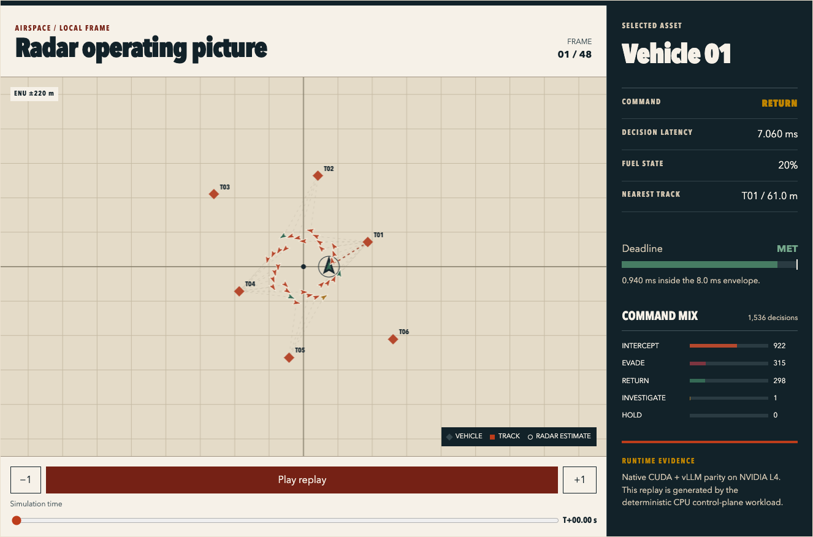
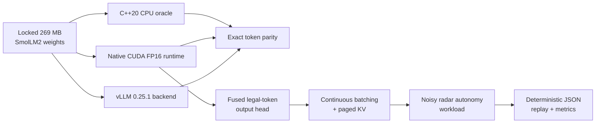

# Velorum

**Real-time C++/CUDA inference and simulation for structured autonomous
systems.**

Velorum is a from-scratch SmolLM2-135M inference stack paired with a
deterministic radar/autonomy workload. It covers the systems path from model
weights to decisions: safe safetensors loading, a readable CPU oracle, custom
CUDA transformer kernels, vLLM serving ablations, continuous batching, paged
KV memory, shared prefixes, grammar-constrained decoding, deadline metrics,
and replayable simulation traces.



The default demo needs no model download and runs on this Mac:

```sh
cmake --preset mac-release
cmake --build --preset mac-release
./build/mac-release/velorum_demo --output demo/velorum-trace.json
python3 -m http.server 8000 --directory demo
```

Open [http://localhost:8000](http://localhost:8000). The included reference
trace works immediately; scenario state and decisions are deterministic for
the same configuration, seed, and runtime.

## What the project demonstrates



- A 30-layer native FP16 CUDA decoder with cuBLAS projections and custom
  RMSNorm, RoPE, causal GQA attention, SwiGLU, embedding, residual, KV-write,
  and greedy-selection kernels.
- A fused constrained output head that scores only legal tied-embedding rows,
  accumulates in FP32, resolves ties deterministically, and avoids allocating
  full 49,152-token logit tensors.
- A backend-neutral finite-choice token DFA, round-robin continuous batching,
  transactional paged KV ownership, and immutable shared-prefix pages.
- A deterministic 2D multi-vehicle workload with noisy range/bearing radar,
  five grammar-safe commands, an 8 ms decision SLA, and an interactive replay.

## Measured evidence

Results below come from the committed evidence artifacts. GPU timings are from
one source-bound NVIDIA L4 run. Autonomy latencies are a deterministic service
cost model used to test scheduling and deadlines; they are not host wall-clock
benchmarks.

| Result | Evidence |
|---|---:|
| Restricted output-head speedup | **1.272×–20.717×** across 12/12 parity cells |
| CUDA Graph single-request speedup | **3.378×** vs eager vLLM |
| CUDA Graph batch speedup | **2.089×** vs eager vLLM |
| Warm shared-prefix speedup | **2.170×** |
| Native CUDA / vLLM greedy output | exact **`[198, 198, 504]`** |
| Autonomy decisions | **1,536**, 100% grammar-valid |
| Decision latency | **7.774 / 8.988 / 9.017 ms** p50/p95/p99 |
| Peak KV-page reduction | **77.5%** with a shared 64-token prefix |
| Deterministic workload rate | **3,571 decisions/service-second**, 27.9× real time |

See [PR9 GPU evidence](docs/pr9-modal-result.json) and the
[PR10 release contract](docs/pr10-contract.md) for provenance and limitations.

## Build and test

Debug with warnings-as-errors:

```sh
cmake --preset mac-debug
cmake --build --preset mac-debug
ctest --preset mac-debug
```

ASan/UBSan:

```sh
cmake --preset mac-sanitize
cmake --build --preset mac-sanitize
ctest --preset mac-sanitize
```

The default suite never downloads weights. The autonomy demo exercises the
control plane without an accelerator; CUDA targets are enabled explicitly on
Linux with `-DMARKETFORGE_ENABLE_CUDA=ON`.

## Small-model policy

Weights are never committed. The locked development model is
[`HuggingFaceTB/SmolLM2-135M`](https://huggingface.co/HuggingFaceTB/SmolLM2-135M)
at revision `93efa2f097d58c2a74874c7e644dbc9b0cee75a2`: one 269 MB BF16
safetensors file. It fits the 36 GB M3 Pro development machine with room for
the FP32 CPU oracle, and the production native/vLLM gates run on one Modal L4.
Every opt-in model load verifies the locked size, SHA-256, tensor set, shapes,
and dtypes first.

The canonical full-model CPU conformance command is:

```sh
.venv/bin/python -m tools.model.conformance \
  --executable build/mac-debug/marketforge_smollm2_conformance \
  --checkpoint /absolute/path/to/model.safetensors \
  --fixture tests/fixtures/golden/smollm2-pr4-greedy-f32.safetensors
```

## Repository map

- `include/marketforge`, `src/cuda`, `src/cpu`: tensor, model, and inference
  runtime.
- `include/marketforge/serving`, `src/serving`: scheduler and paged KV cache.
- `include/velorum`, `src/autonomy`: radar/autonomy workload and trace writer.
- `demo`: dependency-free replay UI and committed deterministic reference
  trace.
- `tools/inference`, `tools/modal`: vLLM adapter and bounded, source-bound L4
  validation.
- `docs`: contracts, progress records, numerical evidence, and limitations.

The retained `marketforge_*` target names are internal historical identifiers;
the public project and final executable are Velorum.

## Cloud budget

Modal validation is bounded to one container and an explicit timeout. The
project stops discretionary launches at a $24 soft cap under a $30 monthly
budget, preserving at least $6. Conservative spend through the accepted PR9
gate is $5.331288. See the [Modal guide](tools/modal/README.md).

## License

Apache-2.0. See [LICENSE](LICENSE).
