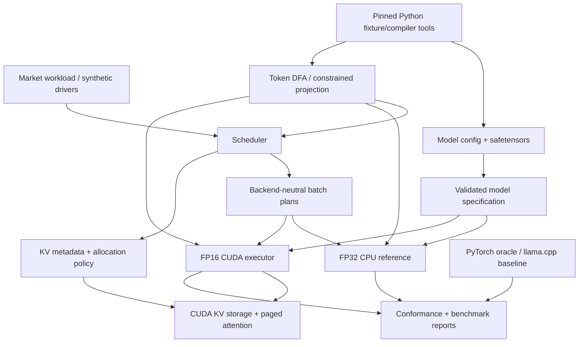

# MarketForge stateful-agent inference runtime plan

Status: canonical planning baseline
Date: 2026-07-28

Implementation is complete through PR 5. See `docs/pr1-report.md`,
`docs/pr2-report.md`, `docs/pr3-report.md`, `docs/pr4-report.md`, and
`docs/pr5-report.md` for local, real-checkpoint, numerical-parity,
memory-stability, finite-grammar, and deterministic-market evidence.
Scope of this cycle: architecture plus detailed specifications for PRs 1–3 only

## Executive decision

Pivot the project.

The systems contribution will be a C++20/CUDA inference runtime specialized for
large populations of agents that produce very short, grammar-constrained
actions. The prediction market becomes a small CPU workload and correctness
fixture, not the GPU centerpiece.

The first credible public milestone is:

- one model architecture: SmolLM2-135M/Llama for runtime bring-up;
- FP32 CPU reference and FP16 CUDA execution;
- pretokenized inputs and greedy decoding;
- cuBLAS for matrix multiplication;
- custom CUDA kernels only where their behavior and performance can be isolated;
- batched prefill and token-by-token decode;
- a deterministic continuous-batching scheduler;
- paged FP16 KV cache with pause/resume and out-of-memory behavior;
- shared immutable prefix blocks;
- allocation-free steady-state decode;
- CUDA Graph replay for measured batch buckets;
- a finite action grammar with a grammar-aware restricted output projection;
- Qwen2.5-0.5B-Instruct only after the SmolLM2 path is stable;
- a small C++ frequent-batch prediction market as the demonstration workload.

Do not promise “10,000 simultaneous agents.” Report four different capacities:

1. registered application agents;
2. sequences with resident KV state;
3. runnable sequences waiting for a token;
4. sequences selected into the current GPU batch.

This distinction is part of the technical contribution. Paged allocation reduces
fragmentation; it does not repeal the KV bytes-per-token equation.

## 1. Audit of the proposed pivot

### Sound decisions

1. **Make inference scheduling the project, not an incidental PyTorch call.**
   Stateful short-output agents produce a real serving workload with dynamic
   arrivals, pauses, shared context, and tail-latency constraints.
2. **Use small open weights.** The full correctness loop can run without a paid
   API, the files are manageable, and model behavior is reproducible when the
   repository revision is pinned.
3. **Use SmolLM2-135M before Qwen2.5-0.5B.** SmolLM2 is small enough for frequent
   CPU and GPU correctness runs. Qwen adds a larger vocabulary, QKV biases, and a
   second tensor naming contract; it should prove portability after the first
   path works.
4. **Use cuBLAS before custom GEMM.** General GEMM is not the differentiator.
   Operator orchestration, cache layout, scheduling, constrained output, and
   launch overhead are.
5. **Treat llama.cpp as a reference competitor.** It provides current Metal and
   CUDA baselines without forcing this project to implement a Metal backend.
6. **Use paged KV and shared prefixes.** They are directly relevant to a workload
   with many short suffixes and a common system/environment prefix.
7. **Delay CUDA Graphs until execution is allocation-free.** Graph topology and
   pointer stability are design constraints, not a button applied to arbitrary
   dynamic code.
8. **Keep the market simulation on the CPU initially.** A second CUDA subsystem
   would split correctness and profiling effort without strengthening the core
   serving claim.
9. **Measure action agreement and environment behavior in addition to tensor
   error.** Quantization and approximation can preserve perplexity while changing
   a discrete action near a decision boundary.

### Questionable decisions

1. **The original 24-PR list is too broad for one developer.** A tokenizer, two
   architectures, custom transformer operators, paged attention, prefix sharing,
   quantization, TensorRT, llama.cpp, a market simulator, and policy scheduling
   are several projects. The active roadmap below defers quantization and
   TensorRT-LLM.
2. **“Implement a tokenizer” is not core inference-runtime work.** Tokenization
   is removed from the native hot path. Python produces canonical token fixtures
   and compiles static prompt fragments/action grammars. The C++ runtime accepts
   token IDs.
3. **llama.cpp is not the numerical oracle.** Its normal GGUF conversion,
   quantization, tokenizer pipeline, and backend kernels make it a useful
   end-to-end baseline, not an intermediate-tensor oracle. Pinned PyTorch
   safetensor fixtures are the oracle.
4. **A full optimized CPU transformer is unnecessary.** Implement readable FP32
   operators and use a BLAS provider for full-model checks. Do not spend the
   project writing CPU SIMD kernels.
5. **Paged KV alone does not make 10,000 long-lived contexts fit.** The cache
   capacity table below makes the constraint explicit.
6. **A full-vocabulary language-model head can dominate constrained decode.**
   Qwen has 151,936 vocabulary entries. For a finite action grammar, computing
   only the currently permitted token logits is a more distinctive and useful
   optimization than another elementwise fusion.
7. **CUDA Graph buckets based only on batch size are underspecified.** Pointer
   stability, active masks, maximum block-table width, and context-dependent
   attention work must be designed before capture.
8. **INT4 and KV quantization are not first-release requirements.** Both add
   calibration, packing, kernel, and behavioral-evaluation work. They proceed
   only after the FP16 runtime has a stable performance model.
9. **Policy-aware scheduling is premature.** First implement a deterministic
   latency/fairness policy and establish scheduler overhead. A learned or
   policy-specific scheduler needs a workload-derived objective.

### Missing specifications

The proposal needs explicit answers for:

- which exact model repositories, revisions, tensor names, and licenses are
  supported;
- which computation dtype is canonical on CPU, T4, Ampere, and Ada;
- tensor layout, stride support, alignment, and ownership;
- whether the runtime accepts text or token IDs;
- RoPE convention, GQA head mapping, causal-mask convention, and QKV bias;
- the numerical oracle and per-operator tolerances;
- greedy versus stochastic decode and RNG reproducibility;
- prompt lifecycle across environment steps;
- what “stateful” means when an agent is idle;
- how many registered, resident, runnable, and batched sequences exist;
- scheduler fairness, prefill starvation, cancellation, and out-of-memory rules;
- KV page size, physical layout, prefix-block immutability, and refcounts;
- cache eviction or recomputation when the device is full;
- graph bucket selection and padding policy;
- whether full-vocabulary or grammar-restricted logits define the result;
- benchmark arrival distributions and prompt/output length distributions;
- which costs are included in time-to-first-action and decisions/second;
- canonical GPU, CUDA image, compiler flags, and model-download cache;
- artifact metadata and the comparison contract with PyTorch and llama.cpp.

### Largest technical risks

1. End-to-end token agreement hides an incorrect intermediate operator when the
   selected logit happens not to change.
2. Scheduler and cache scope expands before single-sequence CUDA inference is
   correct.
3. KV capacity makes the “thousands of stateful agents” headline misleading.
4. The output projection dominates short constrained decoding, masking scheduler
   and kernel improvements.
5. Ragged context lengths and GQA make paged decode attention the real kernel
   challenge, not RMSNorm or residual addition.
6. Remote CUDA iteration and profiler availability slow diagnosis.
7. Graph padding wastes enough computation to erase launch-overhead savings.
8. Supporting Qwen too early turns focused architecture support into a generic
   Hugging Face loader.
9. A weak arrival model produces attractive throughput numbers with no serving
   meaning.

### Scope removed or deferred

Deferred until the FP16 SmolLM2 serving milestone is complete:

- custom Metal kernels;
- arbitrary Hugging Face architectures;
- runtime text tokenization;
- multi-GPU and distributed inference;
- tensor parallelism;
- speculative decoding;
- INT4 weights;
- KV quantization;
- TensorRT-LLM comparison;
- learned or policy-aware scheduling;
- a CUDA market simulator;
- long-form chat;
- unbounded conversational histories;
- online model fine-tuning;
- custom general GEMM.

## 2. Frozen release-1 workload contract

### Model scope

Development model:

- repository: `HuggingFaceTB/SmolLM2-135M`;
- revision: `93efa2f097d58c2a74874c7e644dbc9b0cee75a2`;
- architecture: Llama causal decoder;
- 30 layers, hidden size 576, intermediate size 1,536;
- 9 query heads, 3 KV heads, head dimension 64;
- vocabulary 49,152; tied embeddings;
- no attention bias; RoPE and SwiGLU; 8,192 maximum positions;
- source weights are BF16.

Demonstration model, added late:

- repository: `Qwen/Qwen2.5-0.5B-Instruct`;
- revision: `7ae557604adf67be50417f59c2c2f167def9a775`;
- architecture: Qwen2 causal decoder;
- 24 layers, hidden size 896, intermediate size 4,864;
- 14 query heads, 2 KV heads, head dimension 64;
- vocabulary 151,936; tied embeddings;
- QKV bias, RoPE and SwiGLU; 32,768 configured positions;
- source weights are BF16.

Both model cards currently identify Apache-2.0 licensing. The revisions remain in
a checked-in model lock file; weights remain outside Git.

### Numeric modes

1. **CPU oracle:** FP32 activations and accumulation. BF16 weights are converted
   to FP32 at load time or on first materialization.
2. **CUDA correctness baseline:** FP16 weights/activations with FP32
   accumulation where cuBLAS or a reduction permits it.
3. **Optional BF16 CUDA experiment:** only after FP16 parity and only on
   hardware with appropriate support.
4. **No fast math in conformance builds.** Any fast-math result is a separately
   named benchmark variant.

The T4 is useful for FP16 smoke tests but is not the canonical BF16 device. L4 is
the initial canonical performance GPU; A10 is the first cross-architecture check.

### Request and action contract

The core runtime accepts token IDs, not text:

```text
shared prefix token IDs
        +
agent/environment suffix token IDs
        ->
1–12 generated action tokens
```

Python tooling pinned to the model revision:

- downloads model files into a cache outside the repository;
- produces tokenized golden fixtures;
- compiles static prompt fragments;
- compiles the finite action language into a token DFA;
- exports PyTorch intermediate tensors in safetensors format.

The first market action language is finite:

```text
HOLD
BUY YES <quantity 1..8> @ <tick 1..99>
SELL YES <quantity 1..8> @ <tick 1..99>
```

The runtime follows a token-DFA transition table. At a grammar state, only
outgoing token IDs are candidates. The result is a semantic `Action`, not JSON
that must be repaired.

### Agent-state modes

Release 1 supports two explicitly named modes:

1. **Ephemeral turn, default.** Application state persists, a shared prefix is
   reused, a short agent-specific suffix is prefetched, 1–12 action tokens are
   decoded, and unique KV blocks are released. This is the credible path to
   thousands of registered agents.
2. **Resident history benchmark.** A bounded sequence retains its unique KV
   blocks while paused and can resume later. Capacity is reported from actual
   resident bytes, and histories stop at a configured token limit.

The project will not imply that application state requires an indefinitely
resident language-model conversation.

### Scheduling semantics

- Scheduling occurs at token boundaries.
- Each request has `arrival_tick`, sequence ID, prompt span, maximum output
  length, grammar ID, and cancellation state.
- Tests use logical ticks, not wall-clock time, so batch formation is
  deterministic.
- Decode-ready sequences have priority over new prefill work, subject to a
  configurable prefill-progress guarantee.
- The first implementation uses whole-prompt prefill for short prompts.
  Chunked prefill is an experiment after starvation is measured.
- Within a class, lower arrival tick then lower sequence ID is the stable
  tie-break.
- An OOM does not crash or silently evict live state. The request receives a
  typed rejection unless an explicit eviction/recompute policy is enabled.
- Cancellation releases private KV blocks and decrements shared-prefix
  references exactly once.

### Benchmark workload families

1. **Static saturation:** a fixed runnable population; measures peak throughput.
2. **Bursty agents:** deterministic bursts with idle gaps; measures graph bucket
   selection, queueing, and tail latency.
3. **Pause/resume:** bounded resident histories with changing runnable subsets.
4. **Market trace:** a recorded CPU simulation trace that activates only agents
   requiring decisions.

Synthetic workloads remain primary because their distributions are reproducible.
The market trace is an application demonstration, not the only benchmark.

## 3. Capacity model

For an FP16 KV cache:

`bytes_per_token = 2 × layers × kv_heads × head_dim × 2 bytes`

The first factor of two is K plus V.

| Model | KV bytes/token | Unique 40-token suffix/action per sequence | Unique 128-token state per sequence | Unique 512-token state per sequence |
|---|---:|---:|---:|---:|
| SmolLM2-135M | 23,040 (22.5 KiB) | 0.88 MiB | 2.81 MiB | 11.25 MiB |
| Qwen2.5-0.5B | 12,288 (12 KiB) | 0.47 MiB | 1.50 MiB | 6.00 MiB |

Ten thousand unique 40-token states require roughly 8.6 GiB for SmolLM2 or
4.6 GiB for Qwen, before page fragmentation, block tables, weights,
activations, graph workspaces, and allocator reserve. Ten thousand
1,024-token SmolLM2 contexts would require about 220 GiB of KV alone.

Two non-obvious consequences:

- Qwen's model weights are larger, but its two KV heads make its KV cache cheaper
  per token than SmolLM2's three KV heads across 30 layers.
- Shared-prefix caching is essential for this workload. A 128-token prefix
  copied into 10,000 SmolLM2 sequences would consume about 27.5 GiB; one shared
  immutable copy consumes about 2.8 MiB plus block-table references.

Every capacity result must print:

- weight bytes;
- KV payload bytes;
- page-internal fragmentation;
- block-table/metadata bytes;
- activation/workspace high-water mark;
- free reserve;
- registered, resident, runnable, and batched sequence counts.

## 4. Architecture and dependency direction



Dependencies point toward portable contracts. CUDA, cuBLAS, Python, Metal,
Modal, and llama.cpp headers must not appear in the portable model or scheduler
targets.

### Modules

| Target | Responsibility | Dependencies |
|---|---|---|
| `mf_core` | dtype, shape, tensor views, checked sizes, status/errors | C++20 standard library |
| `mf_model_io` | mapped files, safetensors metadata, model-config validation, weight name binding | core, pinned JSON parser |
| `mf_cpu_ref` | readable FP32 operators, BLAS adapter, single/full-model oracle | core, model I/O, system BLAS |
| `mf_grammar` | immutable token DFA, semantic action IDs, restricted candidate sets | core |
| `mf_scheduler` | deterministic request state machine and batch plans | core, grammar, KV interfaces |
| `mf_kv` | portable page metadata, refcounts, block tables, OOM/cancel semantics | core |
| `mf_cuda` | streams, buffers, cuBLAS, packed weights, kernels, graph cache | CUDA, cuBLAS, core/model/scheduler/KV |
| `mf_market` | small integer-accounted CPU batch auction and prompt assembly | core, scheduler API |
| `mf_conformance` | PyTorch fixtures, CPU/CUDA comparisons, state-machine properties | public APIs |
| `mf_bench` | workload replay and versioned JSON results | selected runtime/backend |
| `tools/model` | pinned download, token fixtures, DFA and PyTorch golden export | Python only |
| `tools/modal` | remote build/test/profile jobs and cost guards | Modal Python SDK |

### Repository shape

```text
CMakeLists.txt
CMakePresets.json
cmake/
include/marketforge/
  core/
  model/
  grammar/
  scheduler/
  kv/
  cpu/
  cuda/                 # declarations expose no CUDA headers
  market/
src/
  core/
  model/
  grammar/
  scheduler/
  kv/
  cpu/
  cuda/
  market/
tests/
  unit/
  property/
  conformance/
  fixtures/tiny/        # tiny generated tensors only
bench/
tools/model/
tools/modal/
models/model-lock.json  # repository, revision, files, hashes; no weights
docs/
results/                # small JSON/Markdown summaries, not profiler binaries
```

## 5. Core C++20 interface sketches

The runtime does not need a general-purpose tensor framework.

```cpp
namespace marketforge {

enum class DType : std::uint8_t {
  f32,
  f16,
  bf16,
  i8,
  i32,
  u32
};

enum class MemoryKind : std::uint8_t {
  host,
  device
};

struct Shape {
  static constexpr std::size_t max_rank = 6;
  std::array<std::uint64_t, max_rank> extents{};
  std::uint8_t rank{};
};

struct TensorView {
  void* data{};
  Shape shape{};
  DType dtype{};
  MemoryKind memory{};
};

struct ConstTensorView {
  const void* data{};
  Shape shape{};
  DType dtype{};
  MemoryKind memory{};
};

enum class Architecture : std::uint8_t {
  smollm2_llama,
  qwen2
};

struct ModelSpec {
  Architecture architecture;
  std::uint32_t layers;
  std::uint32_t hidden_size;
  std::uint32_t intermediate_size;
  std::uint32_t query_heads;
  std::uint32_t kv_heads;
  std::uint32_t head_dim;
  std::uint32_t vocabulary_size;
  std::uint32_t max_positions;
  float rms_norm_epsilon;
  float rope_theta;
  bool qkv_bias;
  bool tied_embeddings;
};

}  // namespace marketforge
```

`Shape` and byte-size helpers reject overflow. Tensor views are non-owning and
contiguous row-major in release 1; arbitrary strides and broadcasting are
deliberately unsupported.

### Model storage

```cpp
class MappedFile {
 public:
  static Result<MappedFile> open_read_only(const std::filesystem::path&);
  ~MappedFile();
  MappedFile(MappedFile&&) noexcept;
  MappedFile& operator=(MappedFile&&) noexcept;
  MappedFile(const MappedFile&) = delete;

  std::span<const std::byte> bytes() const noexcept;
};

struct TensorRecord {
  std::string name;
  DType dtype;
  Shape shape;
  std::uint64_t begin;
  std::uint64_t end;
};

class SafeTensorFile {
 public:
  static Result<SafeTensorFile> parse(MappedFile);
  Result<ConstTensorView> tensor(std::string_view name) const;
};

class LoadedWeights {
 public:
  static Result<LoadedWeights> open_and_bind(
      const std::filesystem::path&, const ModelSpec&);
  const LayerWeights& layer(std::size_t) const;

 private:
  SafeTensorFile file_;  // owns the mapping behind every LayerWeights view
  std::vector<LayerWeights> layers_;
};
```

The safetensors parser validates header size, UTF-8/JSON structure, duplicate
keys, dtype, rank, element-count overflow, exact byte length, nonoverlapping
ordered offsets, full data-buffer coverage, and file bounds before exposing any
view.

### Scheduler and sequence state

```cpp
using sequence_id_t = std::uint64_t;
using token_id_t = std::uint32_t;
using grammar_id_t = std::uint32_t;

enum class SequencePhase : std::uint8_t {
  queued_prefill,
  prefill_ready,
  decode_ready,
  paused,
  completed,
  cancelled,
  rejected
};

struct SequenceRequest {
  sequence_id_t id;
  std::span<const token_id_t> prompt_tokens;
  std::uint32_t max_new_tokens;
  grammar_id_t grammar;
  std::uint64_t arrival_tick;
  PrefixHandle shared_prefix;
};

struct BatchItem {
  sequence_id_t id;
  std::uint32_t slot;
  token_id_t input_token;
  std::uint32_t position;
  BlockTableView blocks;
  GrammarState grammar_state;
};

struct BatchPlan {
  BatchKind kind;  // prefill or decode
  std::span<const BatchItem> items;
  std::uint32_t bucket_size;
  std::uint64_t logical_tick;
};

class InferenceScheduler {
 public:
  Status enqueue(SequenceRequest);
  Result<BatchPlan> form_next_batch(std::uint64_t logical_tick);
  Status complete(std::span<const TokenCompletion>);
  Status pause(sequence_id_t);
  Status resume(sequence_id_t);
  Status cancel(sequence_id_t);
};
```

Scheduling is pure with respect to logical time and completion inputs. Wall-clock
timestamps are collected outside the policy so state-machine tests are
reproducible.

### KV ownership

```cpp
class KvCacheManager {
 public:
  Result<PrefixHandle> publish_prefix(
      PrefixKey, std::span<const token_id_t>);
  Result<SequenceCacheHandle> create_sequence(PrefixHandle);
  Status reserve_append(SequenceCacheHandle, std::uint32_t tokens);
  Status commit_append(SequenceCacheHandle, std::uint32_t tokens);
  Status rollback_reservation(SequenceCacheHandle);
  Status release(SequenceCacheHandle);

  CacheStats stats() const noexcept;
};
```

`PrefixKey` includes model revision, tokenizer revision, exact token IDs,
position/RoPE configuration, KV dtype/layout version, and policy/adapter ID.
Shared blocks are immutable and refcounted. Only full prefix pages are shared in
the first implementation; a partial tail is copied into a private page so
subsequent appends cannot mutate shared storage.

### Grammar-restricted output

```cpp
struct GrammarArc {
  token_id_t token;
  GrammarState next;
};

class ActionDfa {
 public:
  std::span<const GrammarArc> allowed(GrammarState) const noexcept;
  bool terminal(GrammarState) const noexcept;
  Action decode_terminal(GrammarState) const;
};
```

The CUDA restricted-output kernel computes dot products only for the allowed
embedding rows for each sequence, then chooses/samples within that set. Under a
strict grammar mask this is mathematically equivalent to computing full logits
and assigning negative infinity to all disallowed tokens. Differential tests
must prove that equivalence.

## 6. State and memory layout

### CPU reference

- weights remain memory-mapped BF16 and are materialized as FP32 through a
  bounded cache or one-time conversion for full-model tests;
- activations are contiguous row-major FP32;
- attention and MLP scratch belongs to a `CpuWorkspace` allocated at model
  construction;
- the scalar operator implementations favor explicit loops and intermediate
  names;
- full-model GEMMs use a narrow `GemmProvider` backed by Accelerate on macOS and
  a pinned BLAS on Linux.

Do not imitate the CUDA packing in the oracle. Independence is useful.

### CUDA weights and activations

- `CudaModel` owns one immutable `PackedWeights` object per model;
- source tensor layout is converted once during upload when cuBLAS or a kernel
  needs different packing;
- buffers use RAII and explicit stream-aware upload;
- prefill and decode have separate preallocated workspaces;
- temporary-buffer sizes are computed at construction for the configured maximum
  batch/prompt;
- no `cudaMalloc`, model upload, or host synchronization occurs in steady-state
  decode.

Portable public headers use an opaque `StreamHandle` and PIMPL. CUDA types remain
in `.cu`/private headers.

### Scheduler/device metadata

Use SoA arrays for the current batch:

- sequence slot;
- input token;
- current position/context length;
- grammar state;
- block-table row offset;
- active mask;
- output token and completion flag.

Arrays are allocated at the largest graph bucket. Smaller batches fill a stable
prefix of slots and mark padding slots inactive.

### Paged KV

Initial logical page size: 16 tokens. Benchmark 8, 16, and 32 before freezing the
release value.

A logical page allocation reserves K and V storage for every layer, making one
block ID usable across the model. K and V may have different physical layouts:

- K favors vectorized query-dot-product access across head dimension and tokens;
- V favors coalesced weighted accumulation across head dimension.

Block tables are a dense device matrix:

`[max_sequence_slots, max_blocks_per_sequence]`

with separate sequence lengths. The allocator metadata and authoritative
refcounts live on the host for release 1; the device receives compact block-table
updates outside graph replay or through a captured metadata-copy node.

## 7. Correctness strategy

### Oracles

1. **PyTorch/Transformers:** authoritative tensor and logit oracle against the
   pinned safetensors revision.
2. **C++ FP32 reference:** readable implementation used by all native property
   and state-machine tests.
3. **CUDA FP16:** compared at every operator/layer boundary before end-to-end
   generation.
4. **llama.cpp:** end-to-end latency/throughput and memory competitor only.

### Golden fixtures

The Python generator exports:

- model/config/tokenizer revision and package versions;
- exact input token IDs;
- selected source weight tensors or deterministic tiny weights;
- RMSNorm, Q/K/V, RoPE, attention scores/probabilities/output, residual, MLP, and
  final-logit tensors;
- greedy token IDs and logit margins;
- action-DFA allowed sets and semantic actions.

Fixtures use safetensors plus a small JSON manifest. Most committed fixtures are
tiny synthetic shapes. Full-model expected outputs live in the local/CI model
cache and are reproducible from the pinned generator.

### Equivalence levels

| Layer | Required comparison |
|---|---|
| Loader/config | exact names, shapes, dtypes, bytes, revisions |
| Scheduler/KV metadata | exact state transitions, block IDs/refcounts, plans |
| FP32 CPU operator vs PyTorch FP32 | tight absolute/relative tolerance |
| FP16 CUDA operator vs PyTorch FP16/FP32 | operator-specific tolerance and finite checks |
| Greedy decode | exact token on fixtures with a declared minimum logit margin |
| Restricted head vs full masked head | exact selected token; logits within tolerance for all allowed tokens |
| Stochastic sampling, later | exact RNG bits, distribution tests, token agreement only away from CDF boundaries |
| Agent action | exact semantic action on conformance prompts |

No single global tolerance is acceptable. Softmax/attention tolerances scale
differently from residual addition or RMSNorm.

### Failure and robustness tests

- malformed and truncated safetensors;
- duplicate JSON/tensor keys;
- offset overlap, holes, wraparound, incorrect byte count, unsupported dtype;
- invalid model dimensions or head divisibility;
- NaN/Inf propagation and all-masked softmax rows;
- zero-length and maximum-length prompts;
- scheduler cancellation at every phase;
- KV reserve/commit rollback and injected OOM;
- shared-prefix double release and attempted mutation;
- graph padding slots writing output;
- graph bucket miss/fallback;
- CUDA launch/asynchronous error propagation;
- repeated create/destroy under Compute Sanitizer.

## 8. CUDA execution recommendations

### Bring-up path

1. cuBLAS GEMMs plus simple correctness-first kernels;
2. single-sequence prefill with contiguous KV;
3. single-sequence decode;
4. batched fixed-shape prefill/decode;
5. dynamic scheduler feeding fixed backend slots;
6. paged KV and paged GQA decode attention;
7. shared prefixes;
8. allocation-free replay;
9. graph buckets;
10. restricted output projection.

Do not implement the scheduler, paging, and a custom attention kernel
simultaneously.

### Custom kernels worth implementing

Required:

- RMSNorm;
- RoPE with the exact model convention;
- residual/SwiGLU elementwise path, with fusion decided by profile;
- causal/GQA softmax or integrated attention reduction;
- KV writes;
- paged GQA decode attention;
- restricted output projection/reduction;
- greedy and later top-k sampling.

Optional/profile-gated:

- fused residual plus RMSNorm;
- fused gate/up activation if cuBLAS output layout permits it;
- prefill attention beyond a simple correct implementation;
- vectorized conversion/packing during weight upload.

Not required:

- general GEMM;
- a standalone residual-add kernel if it can be folded into an existing
  producer/consumer without harming clarity;
- FlashAttention-style prefill before prefill is measured as a bottleneck.

### cuBLAS choice

Start with `cublasGemmEx` behind a narrow adapter. Evaluate cuBLASLt only when a
specific need appears:

- fused epilogue;
- layout/packing improvement;
- grouped or irregular GEMMs;
- measurable algorithm-selection benefit.

Record the selected math mode, compute type, workspace, algorithm, and
determinism settings.

### CUDA Graphs

Graph capture occurs only after pointers, workspaces, and slot arrays are stable.
Use non-default streams. Start with decode batch buckets:

`1, 2, 4, 8, 16, 32, 64, 128, 256`

Round a runnable batch up to the next bucket and mask padding slots. Attention
uses actual context lengths inside a fixed kernel topology; do not multiply the
graph count by every context length unless evidence demands it.

Compare:

- ordinary launch;
- graph replay;
- graph selection/update cost;
- wasted padded FLOPs;
- tail latency near bucket boundaries.

Keep the ordinary-launch path as the conformance and fallback implementation.
The CUDA programming guide permits repeated executable-graph launches and
parameter/topology-compatible updates, but graph complexity is not justified
until profiling shows launch gaps.

### Profiling questions

| Stage | Evidence to collect |
|---|---|
| Weight upload/packing | copy bandwidth, conversion time, peak host/device bytes |
| RMSNorm/RoPE/SwiGLU | DRAM throughput, vectorization, registers, occupancy, fusion traffic saved |
| Prefill | GEMM utilization, attention share, prompt-length scaling |
| Contiguous decode | GEMM/output-head share, launch gaps, small-batch utilization |
| Paged attention | L2/DRAM efficiency, block-table overhead, divergent context loops, occupancy |
| Scheduler | CPU time/token, lock/contention profile, batch fill, queue-delay distribution |
| Shared prefix | prefill tokens eliminated, refcount overhead, cache hit/eviction rate |
| Restricted head | full-vocab bytes/FLOPs avoided, candidate-count scaling, exact token agreement |
| CUDA Graphs | CPU launch gaps, replay overhead, padding loss, p50/p99 effect |
| End to end | TTFA, inter-token latency, decisions/s, GPU-seconds per million decisions, memory breakdown |

## 9. Pull-request dependency graph

```mermaid
flowchart LR
    P1["1: contracts + build"] --> P2["2: model I/O"]
    P2 --> P3["3: CPU operators + one layer"]
    P3 --> P4["4: CPU SmolLM2"]
    P4 --> P5["5: action DFA + tiny market"]
    P1 --> P6["6: Modal CUDA + RAII"]
    P2 --> P7["7: cuBLAS CUDA forward"]
    P3 --> P7
    P6 --> P7
    P7 --> P8["8: custom CUDA ops"]
    P8 --> P9["9: CUDA SmolLM2"]
    P4 --> P9
    P9 --> P10["10: batched execution + scheduler"]
    P10 --> P11["11: paged KV allocator"]
    P11 --> P12["12: paged decode attention"]
    P12 --> P13["13: shared-prefix cache"]
    P13 --> P14["14: allocation-free steady state"]
    P14 --> P15["15: CUDA Graph buckets"]
    P5 --> P16["16: restricted output projection"]
    P14 --> P16
    P15 --> P17["17: Qwen + agent integration"]
    P16 --> P17
    P17 --> P18["18: baselines, Nsight, release"]
```



The core portfolio milestone is PR 16 with SmolLM2. Qwen integration makes the
demo more convincing but must not hold the scheduler/cache report hostage.

### Roadmap overview

GPU-minute ranges are ceilings for one PR development cycle, not targets.

| PR | Smallest reviewable result | Merge evidence | Where | GPU-min ceiling | Skill shown |
|---:|---|---|---|---:|---|
| 1 | Portable tensor/model contracts and build | sanitizers, boundary tests, no CUDA probe | Mac + Linux CPU | 0 | C++20 API/ownership |
| 2 | Safe mapped model/config loader | adversarial format tests, pinned Smol manifest | Mac + Linux CPU | 0 | binary formats and validation |
| 3 | FP32 transformer ops and one-layer forward | PyTorch intermediate parity | Mac + Linux CPU | 0 | transformer mechanics and numerical testing |
| 4 | Pretokenized SmolLM2 greedy CPU decode | logits/tokens vs PyTorch, stable memory | Mac | 0 | end-to-end model orchestration |
| 5 | Token DFA and minimal market trace | exhaustive grammar, invalid action impossible | Mac | 0 | constrained decoding and workload design |
| 6 | Pinned CUDA/Modal job and RAII primitives | known-answer kernel, sanitizer, manifest | Modal/Colab | 30–60 | CUDA tooling and lifecycle |
| 7 | cuBLAS FP16 forward with contiguous KV | layer parity, explicit stream, no leaks | Modal GPU | 120–240 | mixed precision and library integration |
| 8 | Custom RMSNorm/RoPE/SwiGLU/sampling | per-op parity and profile ablations | Modal GPU | 180–360 | kernel design and profiling |
| 9 | End-to-end CUDA SmolLM2 greedy decode | exact margin-qualified tokens, llama.cpp smoke | Modal GPU | 120–240 | native inference runtime |
| 10 | Batched executor and deterministic scheduler | state-machine properties, queueing traces | Mac + Modal GPU | 120–240 | serving/scheduling |
| 11 | Portable paged allocator and device tables | exhaustive allocator model, OOM/cancel tests | Mac + Modal GPU | 60–120 | memory management |
| 12 | Paged GQA decode attention | contiguous differential, ragged stress | Modal GPU | 180–360 | advanced CUDA memory access |
| 13 | Immutable shared prefixes | exact KV/action parity, memory savings | Mac + Modal GPU | 90–180 | cache ownership/refcounts |
| 14 | Allocation-free steady-state decode | zero allocation/copy trace, fixed high-water mark | Modal GPU | 60–120 | runtime resource discipline |
| 15 | Decode graph buckets | ordinary-vs-graph p50/p99/throughput | Modal GPU | 120–240 | launch optimization |
| 16 | Grammar-restricted output projection | exact masked-head agreement, speedup curve | Modal GPU | 120–240 | workload-specific kernel innovation |
| 17 | Qwen and stateful market-agent demo | architecture diff tests, bounded contexts | Mac + Modal GPU | 180–360 | extensibility without genericity |
| 18 | Baselines, final Nsight report, release | clean reproduction, raw results, limitations | Mac + Modal GPU | 240–480 | performance communication |

Quantization is a later optional branch, not PR 19 by default.

## 10. Detailed specifications for the next three PRs

### PR 1 — Portable contracts, build, and test foundation

#### Purpose

Create the smallest C++20 foundation that can express supported transformer
shapes and non-owning tensors without becoming a general tensor framework.

#### Deliverables

- root target-based CMake project and CPU-only presets;
- `mf_core` library;
- `DType`, `MemoryKind`, `Shape`, `TensorView`, and `ConstTensorView`;
- checked `numel`, dtype-size, byte-size, alignment, and row-major offset helpers;
- `ModelSpec` plus validation for head dimensions, GQA divisibility, dimensions,
  vocabulary, maximum positions, and numeric overflow;
- `Status`, `ErrorCode`, and small `Result<T>` suitable for C++20;
- aligned owning `HostBuffer` with move-only RAII;
- warning, ASan, and UBSan presets;
- test framework pinned to an immutable version;
- architecture decision note stating that tokenizer, CUDA, and generic strided
  tensors are out of scope.

#### Interfaces before implementation

```cpp
Result<std::uint64_t> checked_numel(const Shape&) noexcept;
Result<std::uint64_t> checked_nbytes(const Shape&, DType) noexcept;
Status validate(const ModelSpec&) noexcept;

class HostBuffer {
 public:
  static Result<HostBuffer> allocate(
      std::uint64_t bytes, std::uint64_t alignment);
  ~HostBuffer();
  HostBuffer(HostBuffer&&) noexcept;
  HostBuffer& operator=(HostBuffer&&) noexcept;
  HostBuffer(const HostBuffer&) = delete;

  std::span<std::byte> bytes() noexcept;
};
```

#### Acceptance criteria

- fresh macOS/ARM64 Apple Clang configure/build/test succeeds;
- pinned Linux Clang/GCC CPU job succeeds;
- CUDA is disabled by default and CMake never probes `nvcc`;
- ASan and UBSan pass;
- all supported dtypes have explicit byte-size behavior;
- rank 0, zero extent, rank > 6, extent multiplication overflow, byte-size
  overflow, invalid alignment, and allocation failure are tested;
- SmolLM2's frozen spec validates;
- mutations of every critical field produce the expected validation failure;
- Qwen's frozen spec validates without adding a second execution path;
- `HostBuffer` alignment is tested at 16, 64, and 256 bytes;
- move construction/assignment and injected allocation failure leak nothing;
- public portable headers include no CUDA, Python, PyTorch, llama.cpp, or platform
  BLAS headers;
- no benchmark claim appears in the PR.

#### Test matrix

| Class | Cases |
|---|---|
| Unit | dtype sizes, shape ranks, offsets, model dimensions, Result/Status |
| Boundary | maximum valid extents, every overflow edge, invalid alignments |
| Property | random valid shapes agree with a wider arithmetic oracle |
| Fault | allocator failure and move/destruction sequences |
| Compile | header self-containment and trivially-copyable view types |
| Sanitizer | ASan + UBSan over the full suite |

#### Local/remote and cost

All work is local or CPU CI. GPU minutes: zero.

#### What it proves

Modern C++ value semantics, ownership separation, overflow-safe memory sizing,
portable build design, and resistance to “framework-building” scope creep.

### PR 2 — Safetensors, model configuration, and pinned weight manifests

#### Purpose

Load only the two declared model contracts safely and reproducibly. This PR does
not perform inference.

#### Deliverables

- move-only read-only `MappedFile` for macOS/Linux;
- focused safetensors SAX parser;
- exact tensor metadata validation and lookup;
- model-config JSON parser into `ModelSpec`;
- SmolLM2 weight-name binder with required/optional tensor tables;
- tied-embedding alias handling;
- `models/model-lock.json` with repository, immutable revision, allowed files,
  hashes, license link, and expected architecture fields;
- `tools/model/fetch.py` that downloads only locked files into an explicit cache,
  verifies hashes, and never writes weights into the source tree;
- tiny committed valid/malformed safetensors fixtures;
- fuzz entry point for the header/metadata parser.

The parser follows the documented safetensors contract: 8-byte little-endian
header length, JSON header, row-major tensor data, relative offsets, no
overlapping regions or holes, and exact bounds.

#### Interfaces before implementation

Use the `MappedFile`, `SafeTensorFile`, and `LoadedWeights` interfaces in section
5. `LoadedWeights` owns the mapping behind its bound layer views. A raw
`SafeTensorFile::tensor` view is explicitly borrowed and valid only while that
file object lives; it is confined to loader tests and immediate upload/conversion
code.

#### Acceptance criteria

- valid F32, F16, BF16, I32, rank-0, and empty synthetic tensors parse as
  specified;
- header > configured maximum, truncation at every byte boundary, invalid UTF-8,
  invalid JSON, duplicate keys, unsupported dtype, excessive rank, negative or
  overflowing shape representation, offset overlap, gaps, reversed offsets,
  tensor-byte mismatch, and trailing unindexed data are rejected;
- malformed files never cause out-of-bounds reads under ASan/UBSan;
- a fixed fuzz corpus completes at least 100,000 parser inputs locally or in CPU
  CI without a crash;
- the locked SmolLM2 config exactly matches 30/576/1536/9/3/49,152 and expected
  tensor names/shapes;
- a missing, duplicate, unexpected-critical, or wrong-shaped model tensor yields
  a named error;
- the downloader refuses a moving branch when a commit revision is required;
- corrupted cached files are detected before use;
- model files and cache directories are Git-ignored;
- no test requires network access by default;
- an opt-in integration test fetches the locked SmolLM2 files and prints their
  verified revisions/hashes;
- Qwen remains manifest/config-only; its weight binder is not implemented.

#### Test matrix

| Class | Cases |
|---|---|
| Unit | mapped-file lifetime, metadata lookup, config fields, tensor binding |
| Adversarial | malformed header/JSON/offsets/shapes/dtypes and truncations |
| Property | generated nonoverlapping tensor maps round-trip through official Python writer |
| Fuzz | parser bytes with seed corpus and sanitizers |
| Integration | opt-in pinned Smol model download and full metadata bind |
| Reproducibility | offline cache hit and corrupted-cache rejection |

#### Local/remote and cost

Parsing and all default tests run locally. The one model download is network and
disk, not GPU. GPU minutes: zero.

#### What it proves

RAII file mapping, defensive binary-format parsing, immutable model provenance,
checked external data, and a clean boundary between artifacts and source.

### PR 3 — FP32 transformer operators and one-layer PyTorch parity

#### Purpose

Implement the readable CPU numerical oracle for one SmolLM2 decoder layer.
Correct intermediate values matter more than full-model speed.

#### Deliverables

- FP32 RMSNorm;
- linear/GEMM adapter and tiny scalar fallback;
- Q/K/V reshape and GQA head mapping;
- the exact SmolLM2 RoPE convention;
- causal attention with numerically stable softmax;
- output projection plus residual;
- post-attention RMSNorm;
- gate/up projections, SiLU, elementwise product, down projection, residual;
- contiguous reference KV write/read;
- reusable `CpuWorkspace`;
- Python golden exporter pinned to the Smol revision and a Transformers version;
- tiny deterministic one-layer safetensors fixtures at several shapes;
- operator-specific tolerance table.

#### Interfaces before implementation

```cpp
Status rms_norm_f32(
    ConstTensorView input,
    ConstTensorView weight,
    float epsilon,
    TensorView output) noexcept;

Status apply_rope_f32(
    TensorView query,
    TensorView key,
    std::span<const std::uint32_t> positions,
    const RopeSpec&) noexcept;

Status attention_f32(
    ConstTensorView query,
    ConstTensorView key_cache,
    ConstTensorView value_cache,
    std::span<const std::uint32_t> context_lengths,
    TensorView output,
    CpuWorkspace&) noexcept;

Status smollm2_decoder_layer_f32(
    const LayerWeights&,
    TensorView hidden,
    CpuKvView,
    std::span<const std::uint32_t> positions,
    CpuWorkspace&) noexcept;
```

The operator API validates dtype, shape, memory kind, aliasing contract, and
workspace capacity before mutation.

#### Acceptance criteria

- every operator matches PyTorch FP32 on tiny deterministic fixtures within its
  declared tolerance;
- tests cover batch 1 and >1, query-to-KV GQA mapping, positions 0 and >0,
  context lengths 1 and >1, and causal masking;
- softmax subtracts the row maximum, returns finite outputs for valid rows, and
  rejects an all-masked row;
- RoPE tests would fail if adjacent-pair and half-rotation conventions were
  swapped;
- KV append at a position changes only the expected key/value region;
- an end-to-end decoder layer matches exported intermediate tensors after
  attention and after MLP residuals;
- wrong dtype, wrong shape, non-host view, insufficient workspace, invalid
  position, and illegal aliasing fail before output mutation;
- inputs and weights remain unchanged;
- repeated calls perform no allocation after `CpuWorkspace` construction;
- ASan/UBSan pass;
- the full Smol model is not yet required to generate a token.

#### Test matrix

| Class | Cases |
|---|---|
| Unit | each primitive with hand-computable tiny tensors |
| Differential | every intermediate vs pinned PyTorch |
| Property | normalized RMS bounds, softmax sums, finite outputs, GQA mapping |
| Metamorphic | zero projection/residual identities and repeated-position checks |
| Fault | shape/dtype/workspace/position/alias rejection with unchanged outputs |
| Stress | repeated allocation-free one-layer calls with stable RSS |

#### Local/remote and cost

All correctness work runs locally on the M3 and in a pinned Linux CPU job.
GPU minutes: zero.

#### What it proves

Detailed transformer understanding, numerical stability, GQA/RoPE correctness,
workspace discipline, and independent PyTorch differential testing.

## 11. Local, model, and remote workflow

### M3 daily loop

Run on every change:

1. CPU-only configure and compile;
2. unit/property/conformance fixtures;
3. ASan and UBSan;
4. model/config parser fuzz smoke;
5. FP32 layer/full-model checks as their PRs land;
6. scheduler and KV state-machine tests;
7. llama.cpp Metal benchmarks only at named comparison checkpoints.

Current llama.cpp documentation says Metal is enabled by default on supported
Apple Silicon builds and CUDA is enabled separately on NVIDIA builds. Use its CLI
as an external pinned executable; do not link its internals into the runtime.

### Model artifacts

- never commit weights;
- pin repository commits, not `main`;
- store a model lock and verified file hashes;
- use an explicit project model-cache path;
- provide `fetch`, `verify`, and `purge` operations, with purge targeting only
  the resolved cache directory;
- keep tiny generated fixtures in Git;
- record tokenizer/config revisions with every prompt/action fixture;
- make all default tests offline.

### Modal CPU build

Build CUDA source in a pinned CUDA development image without requesting a GPU.
Persist only compiler caches and verified model artifacts in versioned Volumes.
The build manifest records:

- source revision and dirty status;
- host compiler, CMake, CUDA toolkit, Python, PyTorch, and Transformers;
- configured SM targets and flags;
- cuBLAS version;
- model/tokenizer revisions and hashes;
- dependency lock hashes.

### Modal GPU entry points

- `gpu_smoke`: 3–5 minute timeout; tiny kernels and one-token decode;
- `gpu_conformance`: 10–15 minutes; operator and layer fixtures;
- `gpu_sanitizer`: 15 minutes; tiny cases only;
- `gpu_benchmark`: explicit L4/A10, warm-up, repetitions, JSON result;
- `gpu_profile`: one hypothesis/configuration, compressed Nsight artifact;
- `gpu_sweep`: dry-run matrix and cost estimate required before dispatch.

Development concurrency defaults to one GPU. Every job has a timeout and shard
cap. CPU conformance failure prevents dispatch.

Colab remains useful for an interactive debugger or notebook inspection, but
canonical results come from a pinned environment and explicitly recorded GPU.

## 12. Benchmark contract

### Required metrics

- prefill tokens/second;
- decode tokens/second;
- completed agent decisions/second;
- queue delay;
- time to first action token;
- inter-token latency;
- end-to-end decision latency p50/p95/p99;
- scheduler CPU microseconds per emitted token;
- batch fill and padding ratios;
- resident/runnable/batched sequences;
- peak and categorized GPU memory;
- KV payload utilization and fragmentation;
- prefix hit rate and prefill tokens eliminated;
- restricted-head candidate count and full-vocabulary work avoided;
- GPU-seconds per million completed decisions.

### Required axes

| Dimension | Initial values |
|---|---|
| Model | SmolLM2-135M; Qwen only in PR 17 |
| Runnable batch | 1, 2, 4, 8, 16, 32, 64, 128, 256 |
| Prompt | 32, 128, 512 tokens |
| Unique suffix after shared prefix | 16, 40, 128 tokens |
| Output | 1, 4, 8, 12 tokens |
| Resident sequences | 1×, 4×, 16× runnable count and memory limit |
| Prefix share | 0%, 50%, 90%, 100% |
| Arrival | saturation, deterministic bursts, recorded market trace |
| Launch | ordinary, graph bucket |
| Output head | full vocabulary, strict grammar-restricted |

Do not start with 1,024 active sequences. Add it only if memory and batch curves
show it is meaningful.

### Comparison rules

Compare:

1. PyTorch eager for correctness and a basic GPU reference;
2. llama.cpp for pinned Metal/CUDA end-to-end performance;
3. the custom runtime.

Optionally add vLLM only if the model/version is supported and its serving
semantics can be made comparable. Do not spend a release phase integrating three
baselines.

All backends receive the same token IDs and generation constraints when
possible. Report deviations when llama.cpp cannot consume the same safetensor
precision or grammar path.

Separate:

- model load/upload;
- cold first request;
- warmed prefill/decode;
- scheduler queueing;
- final token/action materialization.

Include cases where a mature baseline wins.

## 13. GPU budget

Using the Modal rates verified in the earlier planning cycle:

| GPU | Approx. USD/GPU-minute | Role |
|---|---:|---|
| T4 | 0.00984 | FP16 smoke only |
| L4 | 0.01332 | canonical 24-GB development/performance GPU |
| A10 | 0.01836 | Ampere cross-check and selected profiles |
| A100 40 GB | 0.03498 | rare final scaling point |

Use a $24 monthly soft cap and reserve the remaining credits for reruns,
CPU/memory charges, or toolchain failures:

| Purpose | Monthly ceiling |
|---|---:|
| CUDA correctness/sanitizer | $6 |
| ordinary development benchmarks | $6 |
| Nsight hypothesis tests | $6 |
| final fixed matrix | $6 |

At current listed rates, $24 is about 1,802 L4 minutes or 1,307 A10 minutes
before CPU/memory charges. The full roadmap spans multiple months; do not spend a
month's budget to force a PR through.

Cost controls:

- compile without a GPU;
- batch small tests into one warm invocation;
- download/verify models once per versioned cache;
- stop on first conformance failure;
- profile one representative shape per hypothesis;
- use L4 before A100/H100;
- cap repetitions and shards;
- print worst-case cost at dry run;
- retain raw results so unchanged commits are never rerun;
- use Colab credits for exploratory work, not canonical matrices.

## 14. Risk register

Probability and impact use 1–5.

| Rank | Risk | P | I | Mitigation/exit evidence |
|---:|---|---:|---:|---|
| 1 | Scope becomes a generic inference framework | 4 | 5 | two locked architectures, token-ID API, no autograd/distribution |
| 2 | Intermediate CUDA math is wrong despite token agreement | 4 | 5 | PyTorch tensors at every layer/operator boundary |
| 3 | “10k agents” overstates resident/active capacity | 4 | 5 | four capacity counters and categorized memory report |
| 4 | Paged attention consumes the schedule | 4 | 5 | contiguous correct path first; allocator and kernel in separate PRs |
| 5 | Output head dominates short-action decode | 4 | 4 | profile early; exact grammar-restricted projection in PR 16 |
| 6 | Scheduler benchmark has unrealistic arrivals | 3 | 5 | saturation, deterministic bursts, pause/resume, and recorded trace |
| 7 | Qwen differences cause architecture abstraction sprawl | 3 | 5 | add only qkv-bias/name-map differences after Smol milestone |
| 8 | Graph padding erases replay benefit | 3 | 4 | bucket-boundary curves and ordinary-launch fallback |
| 9 | Shared-prefix refcount/lifetime bug corrupts KV | 3 | 5 | immutable full pages, model-based allocator tests, sanitizer |
| 10 | Remote profiling is unavailable or unstable | 3 | 4 | PR 6 capability probe; retain timeline/application metrics |
| 11 | CPU reference is too slow for daily full-model tests | 3 | 3 | tiny layer fixtures per change; BLAS; full model scheduled |
| 12 | llama.cpp comparison is unfair | 3 | 3 | publish format/precision/grammar differences and raw commands |
| 13 | Tokenizer drift changes prompts/actions | 2 | 4 | revision-pinned token fixtures and DFA artifacts |
| 14 | Model cache or source revisions drift | 2 | 4 | commit hashes, file hashes, offline default tests |
| 15 | Quantization distracts from the core | 4 | 3 | removed from release-1 roadmap |

## 15. Decisions that require experiments

| Question | Alternatives | Current recommendation | Change gate |
|---|---|---|---|
| Page size | 8, 16, 32 tokens | 16 | change on measured fragmentation + paged-attention throughput |
| Scheduler policy | strict decode priority; weighted prefill/decode; token budget | decode priority with progress guarantee | change if prefill starvation or p99 regression appears |
| Prefill | whole prompt; chunked | whole short prompt | chunk if burst traces starve decode |
| CUDA operator fusion | separate; residual+norm; gate/up+SiLU | separate first | fuse only for ≥10% end-to-end gain with parity |
| GEMM API | cuBLAS; cuBLASLt | cuBLAS adapter | switch for a measured layout/epilogue/algorithm benefit |
| Strategy for variable batch | exact launches; bucket padding; graphs | exact launches then graph buckets | retain graph only where latency/throughput improves |
| Prefix tail | share sealed partial page; copy tail; waste tail | share full pages, copy tail | change if tail copies are material |
| KV metadata authority | host; device; hybrid | host authoritative | move only if update overhead is measured |
| Output projection | full vocab; mask full logits; gather allowed rows | full for oracle, gathered rows for strict DFA | abandon if candidate gather is slower at real allowed-set sizes |
| CPU full-model GEMM | scalar; Accelerate/OpenBLAS; Eigen | narrow system BLAS adapter | change for portability/reproducibility evidence |
| Smol source dtype on GPU | FP16; BF16 | FP16 baseline | add BF16 if supported device shows useful parity/performance |
| Stateful history | ephemeral turns; resident bounded; recompute | ephemeral default + resident benchmark | expand only with a real application need |
| Graph cache keys | batch only; batch×context bucket; full shape | batch bucket + fixed max block table | expand only if topology/work is invalid or too wasteful |

Every optimization report includes hypothesis, revision, hardware/tool versions,
correctness suite, raw samples, uncertainty, profile evidence, and decision.
Failed approaches remain documented.

## 16. Sources and verified assumptions

- SmolLM2 model card and current architecture/license:
  https://huggingface.co/HuggingFaceTB/SmolLM2-135M
- Qwen2.5-0.5B-Instruct model card and current architecture/license:
  https://huggingface.co/Qwen/Qwen2.5-0.5B-Instruct
- safetensors format and safety rules:
  https://github.com/huggingface/safetensors
- llama.cpp Metal/CUDA build behavior:
  https://github.com/ggml-org/llama.cpp/blob/master/docs/build.md
- CUDA Graph creation, instantiation, replay, and update constraints:
  https://docs.nvidia.com/cuda/cuda-programming-guide/04-special-topics/cuda-graphs.html
- current Modal GPU types and pricing:
  https://modal.com/docs/guide/gpu
  and https://modal.com/pricing

## 17. Gate to implementation

**PR 1 — Portable contracts and build**, **PR 2 — Safe mapped model/config
loading**, **PR 3 — FP32 transformer operators and one-layer parity**, and
**PR 4 — Pretokenized SmolLM2 greedy CPU decode** completed their macOS
acceptance matrices on 2026-07-28. Each also passed one bounded CPU-only Modal
Linux portability job. The evidence is in `docs/pr1-report.md`,
`docs/pr2-report.md`, `docs/pr3-report.md`, and `docs/pr4-report.md`.

PR 4 provides:

1. exact locked-checkpoint BF16-to-FP32 materialization with tied embedding/head
   aliasing;
2. full 30-layer prefill and one-token decode over preallocated contiguous K/V;
3. a token-ID-only API with no tokenizer implementation;
4. complete-logit parity against pinned PyTorch under a declared tolerance;
5. exact three-step greedy token parity on a margin-qualified fixture;
6. fixed owned storage in every build and stable ASan-allocated bytes across
   repeated decode;
7. debug, release, ASan/UBSan, artifact-reproducibility, and Linux compiler
   evidence;
8. no CUDA, Qwen weights, generic model registry, or performance claim.

PR 5 completed the immutable SmolLM2 token DFA and minimal deterministic market
trace without adding a tokenizer to native code or market policy to
`CpuSmolLm2`. The next concrete pull request is **PR 6 — Pinned CUDA/Modal job
and RAII primitives**.
