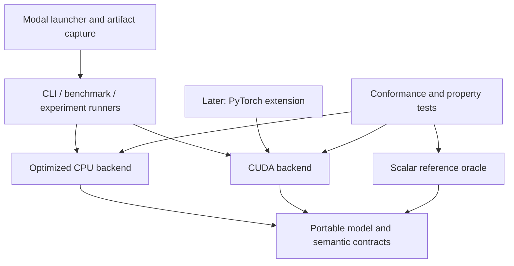
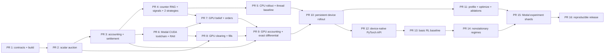

# MarketForge architecture and execution plan — superseded

Status: superseded on 2026-07-28 by the inference-runtime pivot
Date: 2026-07-26
Scope of this cycle: architecture plus detailed specifications for PRs 1–3 only

The canonical plan is now
[inference-runtime-plan.md](./inference-runtime-plan.md). This document remains
as a record of the earlier GPU-native market-simulator direction; do not use its
PR graph as the active roadmap.

## Executive decision

MarketForge is a credible systems project if its first public milestone is narrower
than the proposal:

- one cash-settled YES contract per environment;
- one limit order per agent per batch;
- 101 price points, with quotes restricted to ticks 1–99 and outcomes at 0 or 100;
- 256 agents per environment and independent environments;
- noise and informed agents only for the first CPU/GPU milestone;
- a scalar C++ oracle, then an independently optimized CPU backend, then CUDA;
- exact integer equivalence for auction, accounting, settlement, and counter-based
  random bits;
- tolerance- or distribution-based equivalence for any later floating-point belief
  model.

The first meaningful milestone is not “GPU simulation.” It is a deterministic
market contract whose semantics can be stated as equations, exhaustively tested
on small cases, and implemented independently without ambiguity.

## 1. Proposal audit

### Sound decisions

1. **C++20 CPU reference before CUDA.** The CUDA implementation needs an
   independent semantic oracle. Shared test fixtures are good; shared auction
   implementation code is not.
2. **Frequent-batch auctions.** A bounded price grid permits histograms, scans,
   deterministic tie-breaking, and one independent environment per CUDA block.
3. **Integer price ticks and fixed-point cash.** Matching and settlement do not
   need floating point. This removes a large class of conservation and
   differential-testing failures.
4. **Persistent device state across timesteps.** This is the right eventual
   ownership model. Host/device copies must sit outside the rollout loop.
5. **Structure-of-arrays on the GPU.** The same field across many agents is the
   common access pattern for belief, order, accounting, and observation kernels.
6. **Independent Modal shards rather than a custom distributed system.** Each
   experiment can be an immutable `(revision, config, seed range, hardware)`
   record.
7. **CMake, CTest, sanitizers, and measured benchmarks.** These are central
   deliverables, not repository decoration.
8. **PyTorch outside the simulation hot path.** It should consume and produce
   device tensors only after the native simulator is stable.
9. **No live-money trading.** Live exchange integration would add operational and
   regulatory surface without demonstrating the intended systems skills.

### Questionable decisions

1. **“Thousands of simulations” is not yet a requirement.** It is a benchmark
   axis. The useful capacity depends on agents per market, timesteps, strategy
   cost, and GPU generation.
2. **Exact CPU/GPU determinism is too broad.** It is realistic for integer
   auction/accounting code and a specified integer RNG. It is not a sensible
   promise for arbitrary floating-point `exp`, `log`, FMA contraction, compiler
   flags, or different GPU architectures.
3. **A kernel for every listed stage is premature.** Separate kernels are useful
   while validating semantics, but the final boundaries must be chosen from
   profiles. Conversely, fusing everything early would make failures opaque.
4. **Persistent kernels are not a default optimization.** CUDA Graphs should be
   tried first if launch overhead is material. A persistent kernel complicates
   scheduling, termination, error reporting, and occupancy.
5. **All five strategy families are too much for the first milestone.** Market
   makers require at least two simultaneous orders. Momentum and contrarian
   agents require defined price history and warm-up behavior. Start with noise
   and informed agents.
6. **An RL policy is not evidence that the simulator is correct or fast.** RL and
   continual-learning claims belong after differential tests and an end-to-end
   performance model.
7. **A single “CPU backend” is insufficient.** Keep an obviously correct scalar
   oracle and a separately optimized multithreaded CPU baseline. Otherwise a
   shared optimization bug can bless the GPU result.

### Missing specifications

The proposal currently lacks definitions for:

- contract meaning, short selling, collateral, and the source of settlement cash;
- cash quantum, tick-to-cash conversion, fee rounding, and overflow behavior;
- quote bounds versus outcome values;
- number of orders per agent and whether cancel/replace exists within a batch;
- invalid-order handling and whether application is atomic on error;
- the no-trade price;
- the exact clearing-price tie-break;
- fill priority at and away from the clearing price;
- signal distributions and the timeline of public signal, private signal, order,
  clearing, observation, and resolution;
- counterparty matching versus aggregate long/short accounting;
- event-resolution timing and the latent probability process;
- reproducibility scope and random-stream naming;
- the definition of a “step,” warm-up, and terminal observation;
- CPU/GPU benchmark boundaries and whether setup, transfers, and compilation are
  included;
- target CUDA compute capabilities and the canonical benchmark GPU;
- out-of-memory behavior and maximum supported dimensions;
- error propagation for asynchronous CUDA failures;
- the artifact schema for benchmarks and experiments.

### Largest technical risks

1. Ambiguous accounting produces a fast but economically invalid engine.
2. Slight floating-point differences change discrete orders and cause entire
   trajectories to diverge.
3. Small per-environment work leaves the GPU launch- or synchronization-bound and
   slower than a fair CPU baseline.
4. Heterogeneous strategy branches reduce warp efficiency.
5. Deterministic fill allocation becomes a sort-heavy bottleneck if the initial
   one-order/one-block constraints are relaxed too soon.
6. Remote-only CUDA iteration makes debugging slow and profiling expensive.
7. RL and nonstationarity work consumes the schedule before the native engine is
   credible.

### Scope to remove or defer

Defer until the native CUDA rollout passes differential and performance gates:

- market makers, momentum agents, and contrarian agents;
- multiple live orders per agent;
- continuous limit-order books;
- PyTorch bindings and RL;
- continual-learning claims;
- multi-GPU execution;
- persistent kernels;
- custom distributed infrastructure;
- a Python environment API beyond a thin experiment launcher;
- real market data and live exchange connectivity;
- exact cross-architecture equality for floating-point trajectories.

Remove from the initial public claim:

- unqualified “low latency”;
- unqualified “bitwise deterministic CPU/GPU simulation”;
- a fixed promise of thousands of environments before measuring capacity.

## 2. Market semantics frozen for milestone 1

These choices are prerequisites for implementation.

### Contract and units

- Each environment trades one cash-settled YES contract.
- `price_tick` is an unsigned integer in `[0, 100]`.
- Orders may quote only `[1, 99]`.
- Tick 0 and tick 100 are reserved for event outcomes.
- `cash_unit` is one micro-dollar.
- One contract pays `payout_cash = 1,000,000` cash units when YES resolves and
  zero when NO resolves.
- One price tick is `10,000` cash units. The configuration validator requires
  `payout_cash == outcome_tick * cash_per_tick`.
- Cash and ledger totals use signed 64-bit integers. Quantities and positions use
  bounded 32-bit integers. Every quantity × price calculation uses checked
  widening before commit.

This resolution supports whole-basis-point fee calculations without using
floating point. Display formatting is not part of the domain model.

### Position and collateral model

- Every agent starts with a declared cash balance and position.
- The first fixtures start with total position zero.
- A trade changes the buyer by `(cash -= notional, position += quantity)` and
  the seller by `(cash += notional, position -= quantity)`.
- Signed positions are allowed within `[-position_limit, +position_limit]`.
- After every committed batch, an account must satisfy:

  `cash >= max(0, -position) * payout_cash`

  This is conservative full collateral for a short YES position.
- One agent may submit at most one order in a batch for milestone 1. Therefore an
  order can be risk-checked at its limit price without reserving across multiple
  simultaneous orders.
- A buy that clears below its limit and a sell that clears above its limit can
  only improve the prechecked cash condition.

Later support for multiple orders must add explicit per-batch reservations; it
must not silently reuse this rule.

### Timeline

For timestep `t`:

1. The environment exposes the prior clearing price and public state.
2. The latent process emits the public signal.
3. Each agent receives a private signal from a named random stream.
4. Beliefs update.
5. Each agent emits zero or one limit order.
6. Invalid or unaffordable orders are rejected before the auction.
7. The batch clears at one uniform price.
8. Fills and fees are committed atomically.
9. The clearing price and metrics become the observation for `t + 1`.
10. On the terminal timestep, the outcome is sampled once and all positions
    settle.

The first three PRs use caller-provided orders and outcomes. Signal generation
begins in PR 4.

### Clearing rule

For each candidate quote tick `p`:

- `B(p)` is total buy quantity with limit `>= p`.
- `S(p)` is total sell quantity with limit `<= p`.
- `V(p) = min(B(p), S(p))`.
- `I(p) = abs(B(p) - S(p))`.

Choose the lexicographically smallest key:

`(-V(p), I(p), abs(p - reference_price), p)`

This means maximum volume, then minimum imbalance, then nearest to the previous
clearing price, then the lower tick as the final documented tie-break.

If the maximum volume is zero, report `traded=false`, `matched_quantity=0`, and
leave the environment's last price unchanged. Do not manufacture a clearing
price from empty interest.

### Fill allocation

- Set `Q = V(clearing_price)`.
- Allocate exactly `Q` units independently to eligible buys and eligible sells.
- Buy priority is higher limit price first, then lower `agent_id`.
- Sell priority is lower limit price first, then lower `agent_id`.
- An order is either full or, for at most one boundary order on each side,
  partially filled.
- Fill quantities are returned aligned with input order IDs.
- The ordering of the input container must not affect results.

This is deterministic price/agent priority, not pro rata and not time priority.
Arrival-time priority would make GPU scheduling observable and should not be used.

### Fees and settlement

- Fee rate is integer basis points per side, applied to executed notional.
- `fee = ceil(notional * fee_bps / 10,000)`.
- The default for PRs 1–3 is zero; nonzero fee tests are still required in PR 3.
- Buyer and seller each pay their own fee into a named fee-sink ledger.
- Before fees, buyer notional equals seller notional.
- After fees, decrease in total agent cash equals increase in the fee sink.
- On resolution `y ∈ {0, 1}`, each agent receives
  `position * y * payout_cash`; a short position therefore pays the long side.
- Total position must be zero before settlement in the closed milestone-1 system.
  Settlement then conserves total cash excluding the already accumulated fee
  sink.
- All positions become zero after settlement. Calling settlement twice is an
  error.

## 3. Architecture and dependency direction



Dependencies point inward toward portable domain types. `core` must not include
CUDA, PyTorch, Python, Modal, platform thread APIs, or benchmark libraries.

### Modules

| Module | Responsibility | May depend on |
|---|---|---|
| `marketforge_model` | Strong domain types, validated config, errors, checked arithmetic | C++20 standard library |
| `marketforge_reference` | Obvious scalar auction, allocation, accounting, settlement oracle | `marketforge_model` |
| `marketforge_cpu` | Preallocated rollout state, strategy execution, static environment sharding | model; reference only in tests |
| `marketforge_cuda` | Device ownership, kernels, graph capture, explicit transfers | model, CUDA/CUB |
| `marketforge_conformance` | Shared fixtures and backend-independent invariant checks | public backend APIs |
| `marketforge_bench` | Google Benchmark executables and result metadata | selected backends |
| `marketforge_torch` | Later stream-aware device tensor boundary | CUDA backend, LibTorch |
| `tools/modal` | Remote build/test/profile orchestration and artifact download | Modal Python SDK, CLI contracts |

### Proposed repository shape

```text
CMakeLists.txt
CMakePresets.json
cmake/
include/marketforge/
  model/
  reference/
  cpu/
  cuda/                 # declarations must not expose CUDA headers
src/model/
src/reference/
src/cpu/
src/cuda/
tests/unit/
tests/property/
tests/conformance/
bench/
tools/modal/
docs/
results/                # metadata and small summaries, not profiler binaries
```

CUDA remains an optional CMake language. A normal macOS configure must never try
to discover `nvcc`.

## 4. Core C++20 interface sketches

The names can change during PR review; the semantics must not.

```cpp
namespace marketforge {

using agent_id_t = std::uint32_t;
using order_id_t = std::uint32_t;
using quantity_t = std::uint32_t;
using position_t = std::int32_t;
using cash_t = std::int64_t;
using tick_t = std::uint16_t;

enum class Side : std::uint8_t { buy, sell };
enum class Outcome : std::uint8_t { no, yes };

struct AuctionSpec {
  tick_t min_quote_tick{1};
  tick_t max_quote_tick{99};
  tick_t outcome_tick{100};
  cash_t payout_cash{1'000'000};
  cash_t cash_per_tick{10'000};
  std::uint32_t fee_bps_per_side{0};
  quantity_t max_order_quantity{64};
  position_t position_limit{256};
};

struct Order {
  order_id_t order_id;
  agent_id_t agent_id;
  Side side;
  tick_t limit_tick;
  quantity_t quantity;
};

struct Fill {
  order_id_t order_id;
  quantity_t quantity;
};

struct ClearingSummary {
  bool traded;
  tick_t clearing_tick;       // ignored when traded == false
  quantity_t matched_quantity;
  quantity_t eligible_buy_quantity;
  quantity_t eligible_sell_quantity;
};

struct Account {
  cash_t cash;
  position_t position;
};

struct BatchLedger {
  cash_t buyer_notional;
  cash_t seller_notional;
  cash_t buyer_fees;
  cash_t seller_fees;
  quantity_t bought_quantity;
  quantity_t sold_quantity;
};

struct MarketLifecycle {
  cash_t fee_sink;
  bool settled;
};

enum class ErrorCode : std::uint16_t {
  ok,
  invalid_config,
  invalid_order,
  duplicate_agent_order,
  arithmetic_overflow,
  fill_exceeds_order,
  unbalanced_fills,
  insufficient_collateral,
  position_limit,
  already_settled,
  invalid_outcome
};

struct Status {
  ErrorCode code;
  std::uint32_t item_index;   // offending order/account when applicable
};

}  // namespace marketforge
```

Portable validation returns all configuration errors for setup, while hot-path
operations return a small `Status`; no exceptions cross backend boundaries.

The scalar reference API may allocate because clarity is its purpose:

```cpp
namespace marketforge::reference {

struct AuctionResult {
  ClearingSummary summary;
  std::vector<Fill> fills;  // one entry per input order, keyed by order_id
};

[[nodiscard]] Status validate_orders(
    const AuctionSpec&, std::span<const Order>) noexcept;

[[nodiscard]] Status validate_orders_against_accounts(
    const AuctionSpec&,
    std::span<const Order>,
    std::span<const Account>) noexcept;

[[nodiscard]] AuctionResult clear_batch(
    const AuctionSpec&,
    tick_t reference_price,
    std::span<const Order>);

[[nodiscard]] Status apply_batch(
    const AuctionSpec&,
    std::span<const Order>,
    const AuctionResult&,
    std::span<Account>,
    BatchLedger&,
    MarketLifecycle&) noexcept;

[[nodiscard]] Status settle(
    const AuctionSpec&,
    Outcome,
    std::span<Account>,
    MarketLifecycle&) noexcept;

}  // namespace marketforge::reference
```

`apply_batch` validates all deltas into temporary storage before mutating any
account. Failure must leave accounts, the batch ledger, and the market lifecycle
field-for-field unchanged. On success, it adds both sides' fees to
`MarketLifecycle::fee_sink`. `settle` checks and flips
`MarketLifecycle::settled` but does not modify the fee sink.
`validate_orders_against_accounts` checks the full requested quantity at the
order's limit price, including worst-case fees, before the auction. It rejects
rather than silently resizing an order. Strategy code may use the same checked
helpers to choose a smaller valid quantity.

The optimized backends should be value types, not subclasses:

```cpp
class CpuSimulator {
 public:
  explicit CpuSimulator(const SimulationConfig&);
  StepResult step(const StepInput&);
  Snapshot snapshot() const;
};

class CudaSimulator {
 public:
  explicit CudaSimulator(const SimulationConfig&, CudaOptions = {});
  ~CudaSimulator();
  CudaSimulator(CudaSimulator&&) noexcept;
  CudaSimulator& operator=(CudaSimulator&&) noexcept;
  CudaSimulator(const CudaSimulator&) = delete;

  DeviceStepResult step(DeviceStepInput, StreamHandle);
  Snapshot copy_snapshot_to_host(StreamHandle) const;  // explicit transfer

 private:
  class Impl;
  std::unique_ptr<Impl> impl_;
};
```

The PIMPL prevents CUDA headers and device types from leaking into portable
translation units. Benchmark templates or a small `std::variant` can provide
uniform calling code without a virtual call in the step loop.

## 5. State layout options

### CPU

#### Option A — array of agent structs, recommended for the scalar oracle

```cpp
struct AgentState {
  cash_t cash;
  position_t position;
  std::uint32_t belief_q32;
  std::uint16_t confidence_q16;
  std::uint16_t risk_aversion_q16;
  std::uint16_t latency_steps;
  StrategyKind strategy;
};
std::vector<AgentState> agents;
```

Advantages: readable, easy debugger inspection, one agent update has good
locality. Disadvantages: field-wise loops load unused data and layout is a poor
GPU contract.

Use it in the oracle. Do not force the oracle to imitate the GPU.

#### Option B — SoA, recommended for the optimized CPU backend

One aligned vector per field, flattened market-major:
`index = environment * agents_per_environment + agent`.

Advantages: vectorizable field-wise stages, close conceptual mapping to CUDA,
easy immutable/mutable separation. Disadvantages: more verbose ownership and
poorer locality when a strategy touches most fields.

#### Option C — AoSoA in blocks of 8 or 16

Potentially useful for explicit CPU SIMD while retaining small-agent locality.
It adds indexing complexity and should only replace SoA after a CPU profile shows
that agent-state bandwidth is limiting.

### GPU

#### Option A — flat market-major SoA, recommended

Use owning `DeviceBuffer<T>` objects for:

- market fields: latent probability, public signal, last price, timestep, done;
- agent fields: cash, position, belief, confidence, risk, latency, strategy tag;
- order fields: active, side, limit, quantity;
- result fields: fill quantity, reward, rejection/error flags.

Benefits:

- thread `i` in a warp accesses adjacent agent values;
- an environment maps to a contiguous range;
- buffers are reusable across timesteps;
- fields unused by a kernel generate no traffic;
- snapshots can copy selected fields rather than a monolith.

At 4,096 environments × 256 agents, there are 1,048,576 agent slots. A 48–64 byte
combined logical state is roughly 48–64 MiB before scratch space, comfortably
small on the intended GPUs.

The two 101-bin auction histograms belong in shared memory for the one-block
algorithm: about 808 bytes per environment block with 32-bit counts. They should
not be materialized globally unless a multi-block algorithm requires it.

#### Option B — AoSoA per warp

This can help a strategy that consumes most fields and can reduce pointer count.
It complicates selective kernels and must beat SoA in both end-to-end time and
register pressure before adoption.

#### Option C — one struct of pointers per environment

Reject initially. It adds pointer chasing and many small allocations, complicates
RAII, and makes coalescing dependent on allocator behavior.

### Initial capacity contract

- Default: 256 agents/environment, 4,096 environments, 256 timesteps.
- Quote grid: fixed at 101 values, 1–99 orderable.
- Initial GPU maximum: 256 agents/environment so one CUDA block owns one
  environment.
- Benchmark axes: 64, 128, 256 agents and 256, 1,024, 4,096, 16,384
  environments, subject to memory.
- Quantity limit: 64 contracts/order; position limit: 256.

These are milestone constraints, not universal template parameters. Support for
512+ agents is a later experiment requiring a multi-block/segmented algorithm.

## 6. Reproducibility and equivalence policy

### RNG

Use a locally specified Philox4x32-10-compatible counter function. Do not use
`std::random`, cuRAND state objects, or a mutable generator per thread.

- 64-bit experiment seed becomes the two-word Philox key.
- Counter words are `agent_id`, `environment_id`, `timestep`, and
  `(stream_tag << 16) | draw_block`.
- A draw slot selects a block and one of four output lanes.
- Stream tags are a checked enum: event outcome, public signal, private signal,
  noise action, latency, and later policy exploration.
- Adding a draw in one stream must not shift any other stream.
- Publish known-answer vectors for CPU and CUDA.

This produces exact random bits independent of execution order. Conversion to
Q-format fixed-point is exact. Conversion to floating point is not part of the
bitwise contract.

### Two conformance modes

1. **Exact mode:** integer inputs, Q-format beliefs if needed, integer order
   decisions, clearing, fills, fees, accounts, settlement, RNG outputs, and
   terminal state compare exactly.
2. **Research mode:** floating beliefs or nonlinear likelihood updates compare
   finite values within stated absolute/relative tolerances. Discrete outputs
   compare on fixtures kept away from decision thresholds; long rollouts compare
   invariant counts and statistical summaries over fixed seed sets.

Compiler flags must not disable IEEE safety in correctness jobs. Any
`--use_fast_math` result is a separate benchmark configuration, never the
conformance baseline.

## 7. CUDA algorithm recommendations

### Milestone one-block auction

Map one CUDA block to one environment and one thread to one agent.

1. Zero two 101-entry shared-memory histograms.
2. Active orders add integer quantity to the relevant price bin with
   shared-memory atomics.
3. Use block scans/reductions to compute cumulative eligible quantities.
4. Reduce the documented four-part clearing key.
5. Locate the marginal price level on each side.
6. Orders better than the marginal level fill fully.
7. At the marginal level, a block scan over quantities in ascending `agent_id`
   yields the deterministic partial fill.
8. Apply account deltas only after block-wide validation.

Shared integer atomics are acceptable because addition is exact and the final
value is independent of arrival order. Avoid global atomics in the initial
auction. Use CUB `BlockScan`/`BlockReduce` where they improve clarity; do not add
a device radix sort for a 101-level, 256-agent problem.

### When constraints grow

Evaluate, rather than assume:

- a two-pass global histogram plus segmented scans;
- CUB segmented radix sort on `(environment, side, price_priority, agent_id)`;
- multiple CTAs per large environment;
- grouping fixed-size environments into CTA tiles.

Change the one-block design only if 512+ agents is an actual use case or
occupancy/profiling shows the default mapping is poor.

### Strategy divergence

For the initial two strategies, build stable index lists by strategy and launch
one order-generation kernel per strategy. This keeps each warp homogeneous at
the cost of two launches and indirect indices.

Compare it against one switch-based kernel. Prefer the switch if it is within 5%
end-to-end and removes meaningful scheduling complexity. Do not reorder account
identity; strategy lists contain stable agent indices so fill priority remains
`agent_id`.

### Fusion and persistence

- Start with separate belief/order, auction, fill/accounting, and metrics kernels.
- Try CUDA Graph capture when launch gaps exceed 10% of steady-state rollout
  time.
- Fuse two adjacent kernels only when profiling shows intermediate global-memory
  traffic or launch cost is material, occupancy does not regress materially, and
  the fused path is at least 10% faster end-to-end over three benchmark runs.
- Consider a persistent kernel only if graphs are insufficient and a long,
  fixed-shape rollout is the dominant workload. It must retain a nonpersistent
  conformance path.

### Profiling questions by stage

| Stage | First questions and Nsight evidence |
|---|---|
| Belief/order | Branch and warp efficiency, registers/thread, achieved occupancy, global load efficiency, DRAM throughput |
| Histogram/clear | Shared-memory throughput, atomic serialization, barrier stalls, shared bank conflicts, active warps |
| Fill allocation | Scan/barrier cost, branch divergence at marginal levels, registers, eligible-order distribution |
| Accounting | Coalesced global loads/stores, integer instruction throughput, unexpected atomics, overflow/error branches |
| Full rollout | Kernel-launch gaps, graph replay benefit, HtoD/DtoH activity, GPU utilization, device-memory high-water mark |

Metric spellings vary by Nsight and GPU architecture; store the tool version and
the exact selected metric names with every profile.

### Alternatives and change gates

| Decision | Alternatives | Recommendation now | Evidence that changes it |
|---|---|---|---|
| Random input | mutable per-thread RNG; host-pregenerated buffers; counter RNG | Counter-based Philox-compatible function | Pregeneration wins only if exact vectors fail or counter cost is a measured bottleneck after hiding transfer cost |
| Clearing | order sort; 101-bin histogram; test every order against every tick | Scalar O(A×P) oracle, shared histogram CUDA | Sort/segmented path is ≥10% faster for a required larger shape with exact results |
| Fill priority | pro rata; random lottery; price then agent ID | Price then stable agent ID | A research requirement needs pro rata and a deterministic remainder rule is specified and tested |
| Histogram updates | global atomics; shared atomics; warp-private histograms | Shared integer atomics | Warp-private histogram reduces end-to-end auction time ≥10% without harmful shared-memory occupancy |
| Block primitives | handwritten scan/reduce; CUB block primitives | CUB where it clarifies code | Custom primitive is materially faster and has exhaustive known-answer coverage |
| Strategy execution | switch per agent; kernel per strategy/index list; reorder physical state | Compare switch with per-strategy index lists; never reorder identity | Switch is within 5% end-to-end, or indirect access costs dominate |
| Rollout launches | ordinary launches; CUDA Graphs; persistent kernel | Ordinary first, then Graphs | Persistent kernel beats Graph replay materially and retains a diagnosable reference path |
| CPU parallelism | OpenMP; oneTBB; fixed `std::jthread` workers | Fixed workers with static environment ranges | A portable library provides a clear, measured win worth the dependency |
| PyTorch boundary | copy through NumPy; DLPack; stream-aware C++ extension | Stream-aware extension with preallocated device tensors | DLPack materially simplifies another required framework without ownership bugs |

## 8. Pull-request dependency graph



PR 6 can begin after PR 3 while PRs 4–5 continue, but it must not implement
auction behavior. Its job is toolchain proof, explicit device ownership, and a
trivial known-answer kernel.

### PR execution overview

The GPU-minute ranges are hard ceilings for one development cycle of that PR,
not targets to consume. A failed local or CPU conformance job cancels the remote
job.

| PR | Smallest meaningful result | Main evidence before merge | Execution | GPU-minute ceiling | Reviewer-visible skill |
|---:|---|---|---|---:|---|
| 1 | Portable numeric/domain contract | Clang + ASan/UBSan, boundary tests | Local Mac + pinned Modal CPU repeat | 0 | C++20 API and build hygiene |
| 2 | Scalar deterministic auction oracle | exhaustive tiny states, permutation properties | Local Mac + Modal CPU | 0 | algorithm specification and property testing |
| 3 | Atomic ledger and settlement lifecycle | hand ledgers, conservation, fault injection | Local Mac + Modal CPU | 0 | fixed-point accounting and transactional mutation |
| 4 | Named counter RNG, signals, noise/informed strategies | CPU known-answer RNG vectors, distribution tests | Local Mac + Modal CPU | 0 | reproducible stochastic systems |
| 5 | Preallocated rollout and fair threaded CPU baseline | TSan on Linux, scaling curve, stable RSS | Mac; Modal CPU for TSan/benchmark | 0 | concurrency and performance methodology |
| 6 | Reproducible CUDA build, RAII buffers, profiler capability probe | device known-answer kernel, Compute Sanitizer, manifest | Modal GPU; Colab optional diagnosis | 30–60 | CUDA toolchain and ownership |
| 7 | GPU beliefs and order generation | exact RNG/orders in fixed mode, switch-vs-split result | Modal GPU | 60–120 | CUDA mapping and divergence analysis |
| 8 | GPU clearing and deterministic fills | exact fixtures and randomized differential suite | Modal GPU | 90–180 | shared memory, scans, deterministic parallel algorithms |
| 9 | GPU accounting and end-to-end exact conformance | long rollout differential tests, sanitizer | Modal GPU | 120–240 | GPU correctness and financial invariants |
| 10 | Device-resident 256-step rollout | zero inner-loop transfers, graph ablation | Modal GPU | 120–240 | asynchronous execution and state residency |
| 11 | Profile-led optimizations | Nsight captures, crossover curves, every ablation | Modal GPU | 240–480 | performance engineering |
| 12 | Stream-aware PyTorch vector API | no sync/copy trace, dtype/lifetime tests | Mac CPU build + Modal GPU | 60–120 | systems/ML integration |
| 13 | One reproducible RL baseline | learning curve vs random/fixed heuristics | Modal GPU or Colab | 60–180 | experimental controls, not simulator novelty |
| 14 | Predeclared nonstationary A/B/A benchmark | baselines, seed groups, confidence intervals | Local generation + Modal GPU | 120–300 | scientifically defensible evaluation |
| 15 | Bounded independent experiment shards | dry-run cost, retry/idempotency, artifact completeness | Modal | 180–600 | distributed experimentation without overengineering |
| 16 | Reproducible public release | clean-machine replay and fixed final matrix | Local + Modal GPU | 90–180 | engineering communication and reproducibility |

The entire roadmap is not intended to fit in one month. PRs 6–11 are the core
portfolio milestone. PRs 12–15 proceed only if the native engine has earned them.

## 9. Detailed specification: next three PRs only

### PR 1 — Freeze contracts and establish the portable build

#### Purpose

Turn the economic and numeric decisions above into compiling C++20 types and
validation rules. This PR must not contain a clearing implementation.

#### Files and interfaces

- root CMake project and CPU-only `CMakePresets.json`;
- `marketforge_model` target;
- public types shown above;
- `validate(AuctionSpec)` returning all setup errors;
- checked notional and fee helpers returning `Status`;
- `docs/market-semantics.md` containing the frozen equations and examples;
- CTest unit target;
- optional warning-as-error policy for project sources only;
- sanitizer preset for local Clang ASan + UBSan.

Pin any test dependency to an immutable version. Prefer a normal CMake package
with `FetchContent` fallback, cached in CI; do not vendor an unreviewed framework
snapshot.

#### Deliberate exclusions

- no CUDA language;
- no Python;
- no random generator;
- no auction implementation;
- no benchmark numbers;
- no agent inheritance hierarchy;
- no serialization format.

#### Review sequence

1. Build and preset structure.
2. Numeric and domain types.
3. Configuration validation and checked arithmetic.
4. Semantic document and unit tests.

#### Acceptance evidence

- fresh macOS/ARM64 configure/build/test succeeds with Apple Clang;
- `MARKETFORGE_ENABLE_CUDA` defaults off and CMake does not probe CUDA;
- ASan/UBSan tests pass;
- invalid quote ranges, inconsistent payout/tick conversion, excessive fee,
  zero quantity limits, and unsafe numeric maxima are rejected;
- checked multiplication tests cover both largest accepted values and overflow;
- public POD data types needed by CUDA are standard-layout and trivially
  copyable, asserted at compile time;
- no production source includes a CUDA, Python, or PyTorch header.

#### Skill demonstrated

Modern CMake target hygiene, portable C++20 API design, fixed-point modeling,
checked arithmetic, explicit error contracts, and ABI-conscious data types.

### PR 2 — Implement the scalar auction and deterministic fill oracle

#### Purpose

Implement the easiest version to audit, not the fastest. This becomes the
semantic differential oracle.

#### Interfaces

- `reference::validate_orders`;
- `reference::clear_batch`;
- documented pure helper for clearing-key comparison;
- results keyed by unique `order_id`;
- optional test-only brute-force matching enumerator independent of the
  histogram implementation.

The production oracle may use O(agents × price levels) loops. With 256 × 99 this
is cheap enough and easier to inspect than a clever scan.

#### Error rules

- reject zero quantity, out-of-range tick, duplicate order ID, duplicate agent
  order, invalid side value, and quantity above configured maximum;
- on invalid input return an error and no partial result;
- no-trade is a valid result, not an error;
- `reference_price` must be a quote tick.

#### Acceptance evidence

- hand-worked examples cover one-price crossing, partial boundary fill, multiple
  clearing-price ties, nearest-reference tie, final lower-tick tie, and no trade;
- exhaustive small-state test enumerates all order sets up to a bounded size
  (for example two agents/side, ticks 1–3, quantities 1–2) and compares the
  oracle with an independently written brute-force checker;
- permutation property: shuffling input order storage cannot change clearing
  summary or fills keyed by order ID;
- conservation: bought quantity equals sold quantity equals matched quantity;
- every fill is nonnegative and no greater than its submitted quantity;
- only eligible orders fill;
- price stays within quote bounds;
- at most one partial order per side;
- deterministic repeat: 10,000 repeats of every fixed fixture are field-identical;
- scalar stress case with the maximum validated order count completes without
  overflow or sanitizer findings;
- a benchmark may record oracle throughput for regression detection, but this PR
  makes no performance claim.

#### Deliberate exclusions

- account mutation, collateral, fees, and settlement;
- signals or strategies;
- threading;
- CUDA;
- pro-rata or arrival-time allocation.

#### Skill demonstrated

Algorithm specification, lexicographic deterministic reduction, independent
oracle construction, exhaustive/property testing, and careful separation of
semantics from optimization.

### PR 3 — Add atomic accounting, collateral, fees, and settlement

#### Purpose

Complete a caller-driven CPU market lifecycle. After this PR, a test can submit
orders, clear a batch, apply balanced fills, and settle an outcome without
signals or agent strategies.

#### Interfaces and implementation rules

- `reference::validate_orders_against_accounts`, called before clearing;
- `reference::apply_batch`;
- `reference::settle`;
- fee-sink and batch-ledger types;
- checked delta accumulation;
- two-phase validate-then-commit account mutation;
- lifecycle flag preventing second settlement or post-settlement trading.

No pairwise counterparty objects are required. Aggregate buyer and seller fills
at the uniform price are sufficient because both sides have the same total
quantity.

#### Acceptance evidence

- long/short cash and position example is hand-calculated through YES and NO
  settlement;
- buyer notional equals seller notional before fees;
- bought quantity equals sold quantity;
- total agent cash plus fee sink is conserved across trading;
- with total position zero, settlement conserves total agent cash and zeroes all
  positions;
- YES pays exactly `payout_cash` per long contract and charges the same per short;
- NO changes no cash at settlement;
- fee rounding tests cover zero, exact division, and one-unit round-up;
- fills over order quantity, unbalanced sides, overflow, position-limit breach,
  insufficient collateral, duplicate settlement, and post-settlement trade are
  rejected;
- an unaffordable full order is rejected before clearing, including fee and
  worst-case limit-price exposure;
- every rejected application leaves accounts, fee sink, lifecycle state, and
  ledger field-for-field identical to their pre-call values;
- property tests generate valid balanced fills and check all accounting
  invariants for at least 100 fixed seeds;
- mutation/fault tests deliberately alter one fill or ledger field and prove the
  validator detects the inconsistency;
- ASan/UBSan and a debug standard-library build pass locally;
- one million small batch applications form a non-gating stress executable with
  no unbounded allocations or RSS growth.

#### Deliberate exclusions

- random event generation; the outcome is caller-provided;
- agent belief or order policies;
- multithreading and CUDA;
- portfolio margin across markets;
- interest, borrowing, liquidation, or bankruptcy.

#### Skill demonstrated

Transactional state mutation, integer financial accounting, collateral
invariants, overflow safety, lifecycle design, and stateful property testing.

## 10. Test matrix for PRs 1–3

| Test class | PR 1 | PR 2 | PR 3 | Local Mac | Modal CPU | NVIDIA GPU |
|---|---|---|---|---|---|---|
| Unit | config, types, arithmetic | tie-breaks, eligibility, partial fills | fees, margin, settlement | required | repeat in pinned Linux image | not needed |
| Exhaustive | numeric boundary table | tiny order-book state space | tiny account/fill state space where tractable | required | optional | not needed |
| Property | valid-config generators | permutation and conservation | cash/position conservation and atomic failure | required | required before merge | not needed |
| Differential | helper vs hand vectors | oracle vs brute-force checker | lifecycle vs hand ledger | required | required | begins in later CUDA PRs |
| Stress | checked extrema | max valid order count | 1M small batches, RSS stable | non-gating | scheduled | not needed |
| Performance | none | regression-only scalar rate | allocation/RSS observation | optional | canonical CPU later | not needed |
| Sanitizers | ASan, UBSan | ASan, UBSan | ASan, UBSan | required | UBSan; later TSan | unsupported/not useful |

TSan begins with the multithreaded backend, not before. CUDA Compute Sanitizer
begins with PR 6 and is run on deliberately tiny fixtures because it is slow.

## 11. Local versus Modal workflow

### Local macOS/ARM64

Run on every change:

1. configure and compile portable targets with Apple Clang;
2. unit, exhaustive-small, and property tests;
3. ASan + UBSan preset;
4. scalar and multithreaded CPU benchmarks once those targets exist;
5. fixture generation and expected-result review;
6. static formatting/lint checks.

The local build is the development loop. CUDA must remain optional so the Mac is
never a second-class environment.

### Modal CPU build job

Use a pinned NVIDIA CUDA *development* base image to run `nvcc` compilation
without requesting a GPU. Cache compiler downloads and `ccache` data in a small
Volume keyed by CUDA/compiler version. Produce a build manifest containing:

- Git revision and dirty flag;
- compiler and CMake versions;
- CUDA toolkit version;
- configured architectures;
- dependency lock hashes;
- compile flags.

Image construction and source upload are outside GPU billing. A GPU is requested
only for runtime tests or profiles.

### Modal GPU jobs

Define separate entry points:

- `gpu_smoke`: 2–5 minute timeout, one cheap T4 or L4, tiny CTest labels;
- `gpu_differential`: 10–15 minute timeout, fixed fixtures and seed ranges;
- `gpu_sanitizer`: 15 minute timeout, tiny cases only;
- `gpu_benchmark`: explicit GPU model, warm-up, repetitions, JSON artifact;
- `gpu_profile`: one kernel/config at a time, explicit Nsight output artifact.

Set one container for development jobs and cap experiment-shard concurrency even
if the account permits more. Parallelism reduces wall time but not GPU-seconds
and makes accidental fan-out easier.

Every function has a hard timeout. Every sweep has a maximum shard count and an
estimated upper-bound cost printed before dispatch. A `--dry-run` mode emits the
matrix and cost estimate without starting remote work.

Use Colab Pro for interactive CUDA debugging when convenient, but do not make it
the canonical benchmark environment: allocation, GPU model, and image are less
controlled.

The initial compiled targets are `sm_75` for cheap T4 smoke tests and `sm_86` or
`sm_89` for A10/L4 performance work. Compile a target-specific binary for
canonical measurements rather than benchmarking a JIT on first use. Add Ampere
A100 or Hopper targets only for an explicit cross-architecture experiment. A10
is the initial profiling reference; T4 is the lowest-cost smoke device and L4 is
the cost-efficient comparison.

### Transfer ownership test

All host/device transfers go through explicit backend methods instrumented by a
test counter. A rollout test:

1. uploads configuration/state;
2. resets the transfer counter;
3. executes at least 100 device-generated steps;
4. asserts zero HtoD and DtoH calls;
5. downloads one final snapshot explicitly.

For release evidence, corroborate this with an Nsight Systems trace showing no
inner-loop memcpy. The counter catches library-owned copies; the trace catches
copies that bypass the wrapper.

## 12. GPU budget model

Modal bills per second and supports workspace/environment budgets. As of
2026-07-26, listed GPU rates are approximately:

| GPU | USD/second | USD/GPU-minute | GPU-minutes for $24 soft cap |
|---|---:|---:|---:|
| T4 | 0.000164 | 0.00984 | 2,439 |
| L4 | 0.000222 | 0.01332 | 1,802 |
| A10 | 0.000306 | 0.01836 | 1,307 |
| A100 40 GB | 0.000583 | 0.03498 | 686 |
| H100 | 0.001097 | 0.06582 | 365 |

CPU and memory during the job are additional but small relative to GPU cost.
Prices can change, so the launcher must keep rates in a dated config rather than
hard-code them in C++.

Recommended monthly allocation within roughly $30 of credits:

| Purpose | Ceiling | Operating rule |
|---|---:|---|
| CUDA smoke and differential development | $8 | T4 first; batch several tests per warm container |
| Sanitizer and debugging | $4 | tiny fixtures; stop after first failure |
| Nsight profiling | $6 | A10 or L4; one hypothesis per capture |
| Cross-GPU final benchmarks | $8 | fixed matrix; three or more steady repetitions |
| Reserve | $4 | toolchain breakage or reruns |

Cost reductions:

- compile CUDA in a CPU-only container and cache `ccache`;
- fail CPU conformance before dispatch;
- run all small GPU test labels in one invocation;
- upload only changed source and download only compressed artifacts;
- warm up once, then benchmark several sizes;
- do not profile full parameter sweeps;
- keep default development GPU fixed so architecture changes are not confused
  with code changes;
- use the expensive GPU only for a final architecture comparison, not ordinary
  correctness.

Current Modal documentation says Functions are billed per second, permit hard
timeouts, support persistent Volumes, and allow an explicit GPU type. The pricing
and billing references used for this model are:

- https://modal.com/pricing
- https://modal.com/docs/guide/billing
- https://modal.com/docs/guide/gpu

## 13. Fair CPU/GPU benchmark contract

Benchmark three implementations:

1. scalar semantic oracle;
2. optimized CPU backend using a fixed `std::jthread` worker pool and static
   environment ranges;
3. CUDA backend with state already resident.

Report:

- environments/second and agent-steps/second;
- batch latency distribution for fixed shapes;
- setup/upload/download separately from steady rollout;
- end-to-end episode time including final snapshot;
- exact compiler flags, thread count, physical/logical CPU information, GPU,
  clocks if observable, driver, CUDA, CMake, and revision;
- median and dispersion across at least three process-level repetitions.

Use identical semantics and pre-generated inputs. Do not include CPU thread-pool
creation inside the steady loop or GPU compilation/context initialization inside
kernel time. Also publish an end-to-end cold measurement so exclusions are
visible.

The optimized CPU backend statically partitions independent environments. This
is deterministic, avoids a dependency on Apple-unfriendly OpenMP, and prevents a
work-stealing scheduler from contaminating small latency tests. Linux-only
affinity is an optional benchmark control, not core logic.

## 14. Later PyTorch and nonstationarity boundaries

### PyTorch

After PR 10, expose an opaque simulator object through a C++ extension:

- internal state remains owned by CUDA RAII buffers;
- `step` accepts device action tensors and the current CUDA stream;
- observations, rewards, and done flags are written to preallocated CUDA tensors;
- no implicit synchronization or `.cpu()` occurs;
- tensor dtype, shape, device, alignment, lifetime, and stream requirements are
  validated;
- DLPack is a fallback for framework-neutral interoperability, not the first
  ownership model.

### Nonstationary regimes

Start with exogenous, fully recorded schedules:

1. abrupt switch in the signal-to-outcome relationship;
2. gradual log-odds drift;
3. recurring A–B–A regime to measure return performance.

Do not simultaneously change signal reliability, fee schedule, and agent
population in the first experiment; that prevents causal interpretation.

Scientifically defensible initial metrics:

- prequential reward/utility with confidence intervals across seed groups;
- post-change adaptation area and time to recover 90% of a regime-specific
  oracle/reference score;
- worst rolling-window performance;
- return-to-A performance relative to the first A period;
- dynamic regret against a documented per-regime comparator;
- compute and sample budget.

Include no-adaptation, periodic-retrain, and replay baselines. Avoid a
“continual-learning” claim from one hand-picked trajectory.

## 15. Making the repository legible to experienced reviewers

The public repository should lead with evidence, not a feature list:

1. A five-minute CPU-only quick start that builds on macOS without CUDA.
2. A one-page semantic example showing orders, clearing-key candidates, fills,
   ledger deltas, and YES/NO settlement.
3. A diagram of ownership and dependency direction.
4. A correctness table listing unit, exhaustive, property, differential,
   sanitizer, and stress coverage.
5. Reproduction commands for one CPU and one GPU benchmark.
6. Crossover plots that include cases where the CPU wins.
7. Optimization reports with before/after profiles and rejected approaches.
8. A manifest beside each result: revision, dirty flag, compiler, flags, CUDA,
   driver, GPU, CPU, config, seed set, warm-up, repetitions, and raw samples.
9. A limitations section stating the one-order, 101-tick, 256-agent initial
   constraints and the floating-point equivalence policy.
10. Small source files with explicit ownership; no inheritance tree, generic
    “manager” classes, or Python orchestration in the native hot path.

An experienced reviewer should be able to distinguish the scalar oracle,
optimized CPU baseline, and CUDA implementation, then trace a single invariant
through all three.

## 16. Ranked risk register

Probability and impact use 1 (low) to 5 (high). Rank is ordered by the product,
then by how early the risk can invalidate the project.

| Rank | Risk | P | I | Mitigation and exit evidence |
|---:|---|---:|---:|---|
| 1 | Accounting/market semantics are internally inconsistent | 4 | 5 | Freeze milestone semantics; hand ledgers; exhaustive and mutation tests in PRs 1–3 |
| 2 | GPU is slower than optimized CPU for intended shapes | 4 | 5 | Publish crossover curves; scale environments; simplify kernels; accept a bounded negative result |
| 3 | Float differences cause trajectory explosion | 4 | 4 | Exact integer mode; threshold-separated fixtures; statistical research-mode contract |
| 4 | Scope reaches RL before systems core is credible | 4 | 4 | Hard gate PR 12 on PR 10 correctness and PR 11 profile report |
| 5 | Fill allocation loses determinism or becomes sort-bound | 3 | 5 | One order/agent, fixed 101 ticks, price+ID priority, one-block scan |
| 6 | Remote CUDA iteration is too slow to debug effectively | 4 | 3 | CPU oracle first; tiny Modal smoke jobs; cached builds; Colab only for interactive diagnosis |
| 7 | Strategy heterogeneity creates warp divergence | 3 | 4 | Two initial strategies; indexed per-strategy kernels; switch-vs-split experiment |
| 8 | Integer multiplication or ledger accumulation overflows | 2 | 5 | Validate global maxima; checked widening; boundary property tests |
| 9 | Nsight counters unavailable in serverless environment | 3 | 3 | Probe in PR 6; retain timeline and application-level metrics; use another remote GPU only if required |
| 10 | One-block/environment caps useful agent counts | 3 | 3 | Treat 256 as milestone contract; benchmark multi-block only after need is shown |
| 11 | Modal or CUDA toolchain drift breaks reproducibility | 3 | 3 | Pin image/toolkit/dependencies; record manifest; scheduled rebuild |
| 12 | Nonstationary benchmark supports weak scientific claims | 3 | 3 | Predeclare schedules, baselines, metrics, and seed groups |

## 17. Decisions that require experiments

These should not be settled by taste:

1. **One switch kernel vs per-strategy kernels.** Change recommendation if the
   switch is within 5% end-to-end across representative strategy mixes.
2. **Shared atomic histogram vs alternatives.** Retain atomics unless a
   reduction/sort path is at least 10% faster with equal occupancy and exact
   results.
3. **CUB block primitives vs small custom scans.** Prefer the clearer
   implementation within 5%; otherwise document the custom ablation.
4. **SoA vs warp-sized AoSoA.** Change only on end-to-end improvement, not a
   microbenchmark alone.
5. **One block/environment vs tiled environments/block.** Measure 64-, 128-, and
   256-agent cases; small environments may underuse a full block.
6. **Separate kernels vs fusion.** Require at least 10% steady rollout gain and
   no conformance loss or damaging occupancy regression.
7. **CUDA Graphs vs persistent kernel.** Try graph capture first; persistent wins
   only if it adds material end-to-end gain for fixed long rollouts.
8. **Fixed-point vs float belief updates.** Compare policy fidelity, speed, and
   threshold sensitivity against a double-precision offline model.
9. **T4/L4/A10 architecture sensitivity.** Do not generalize one GPU result.
10. **CPU worker count and scheduling.** Report throughput versus threads and use
    physical-core count near saturation.
11. **256-agent cap.** Build a 512-agent prototype only if target workloads or
    performance curves justify multi-block complexity.
12. **Nsight availability on Modal.** A PR 6 probe must show which timeline and
    hardware counters can be captured.
13. **PyTorch-owned output buffers vs wrapped simulator buffers.** Choose based
    on allocation cost, stream safety, and ownership complexity.

Each experiment record must include hypothesis, invariant suite, code revision,
configuration, hardware/software manifest, raw samples, summary, and decision.
Failed optimizations remain in a short report even if their code is removed.

## 18. Gate to the next planning cycle

The next concrete pull request is **PR 1 — Freeze contracts and establish the
portable build**.

Do not begin PR 2 until PR 1 provides:

1. reviewed `market-semantics.md` with the contract, collateral, clearing, fee,
   and settlement equations;
2. compiling public types and validation interfaces;
3. passing macOS Clang tests under ASan and UBSan;
4. boundary evidence that accepted dimensions cannot overflow defined numeric
   types;
5. a CPU-only configure proving no CUDA probe occurs.

The next architecture review should examine the actual PR 1 diff and test output,
not reopen downstream CUDA optimization choices without new evidence.
